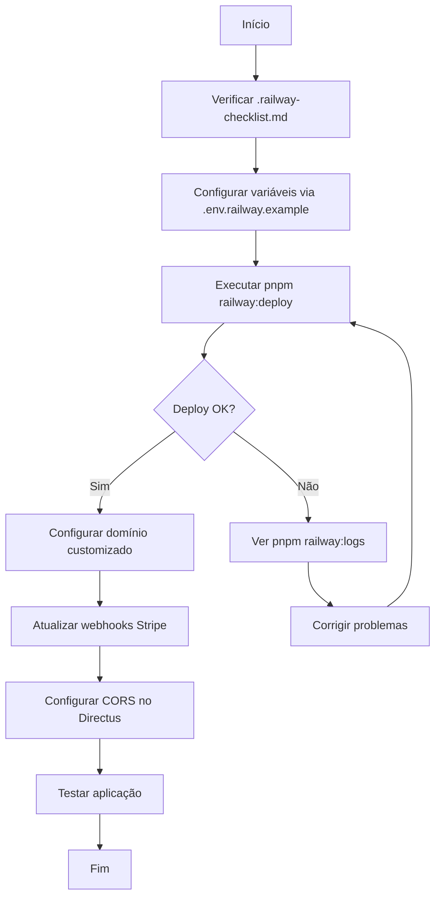

# Guia Completo de Deploy no Railway

Este é o guia principal para fazer deploy do projeto Next.js no Railway.

## 📚 Documentação Disponível

### Para Começar

1. **[DEPLOY_QUICKSTART.md](./DEPLOY_QUICKSTART.md)** - ⚡ Start rápido com comandos essenciais
2. **[RAILWAY_DEPLOY.md](./RAILWAY_DEPLOY.md)** - 📖 Guia completo e detalhado de deploy
3. **[.railway-checklist.md](./.railway-checklist.md)** - ✅ Checklist pré e pós-deploy

### Configuração

4. **[.env.railway.example](./.env.railway.example)** - 🔐 Template de variáveis de ambiente
5. **[CUSTOM_DOMAIN.md](./CUSTOM_DOMAIN.md)** - 🌐 Configurar domínio customizado

### Arquivos de Configuração

- **[railway.json](./railway.json)** - Configuração de build e deploy
- **[nixpacks.toml](./nixpacks.toml)** - Configuração do ambiente de build
- **[scripts/railway-deploy.sh](./scripts/railway-deploy.sh)** - Script helper para deploy

## 🚀 Quick Start (3 passos)

### 1. Login e Vincular

```bash
railway login
railway link  # Selecione: events-flow
```

### 2. Configurar Variáveis

```bash
# Mínimo necessário:
railway variables set NEXT_PUBLIC_DIRECTUS_URL=https://seu-directus.up.railway.app
railway variables set DIRECTUS_PUBLIC_TOKEN=seu-token-publico
railway variables set DIRECTUS_FORM_TOKEN=seu-token-form
railway variables set DIRECTUS_ADMIN_TOKEN=seu-token-admin
railway variables set NEXT_PUBLIC_SITE_URL=https://seu-app.up.railway.app
railway variables set DRAFT_MODE_SECRET=$(openssl rand -base64 32)
railway variables set NEXT_PUBLIC_ENABLE_VISUAL_EDITING=true
```

### 3. Deploy!

```bash
# Opção 1: Deploy direto
railway up

# Opção 2: Script interativo (recomendado)
pnpm railway:deploy
```

## 📦 Scripts NPM Disponíveis

```bash
pnpm railway:deploy   # 🚀 Deploy com verificações interativas
pnpm railway:logs     # 📋 Ver logs em tempo real
pnpm railway:status   # 📊 Status do serviço
pnpm railway:open     # 🌐 Abrir no navegador
pnpm railway:vars     # 🔐 Listar variáveis
```

## 📋 Fluxo Recomendado



## 🔍 Estrutura de Arquivos

```
events-flow-front/
├── README_DEPLOY.md              # 👈 Você está aqui
├── DEPLOY_QUICKSTART.md          # Quick reference
├── RAILWAY_DEPLOY.md             # Guia detalhado
├── CUSTOM_DOMAIN.md              # Configurar domínio
├── .railway-checklist.md         # Checklist
├── .env.railway.example          # Template de variáveis
├── railway.json                  # Config Railway
├── nixpacks.toml                 # Config Nixpacks
└── scripts/
    └── railway-deploy.sh         # Helper script
```

## 🎯 Por Onde Começar?

### Se você nunca usou Railway antes:
👉 Comece com **[RAILWAY_DEPLOY.md](./RAILWAY_DEPLOY.md)**

### Se você já conhece Railway:
👉 Vá direto para **[DEPLOY_QUICKSTART.md](./DEPLOY_QUICKSTART.md)**

### Antes de fazer deploy:
👉 Leia **[.railway-checklist.md](./.railway-checklist.md)**

### Para configurar domínio próprio:
👉 Siga **[CUSTOM_DOMAIN.md](./CUSTOM_DOMAIN.md)**

## 🔧 Configurações Importantes

### Variáveis Obrigatórias

```
✅ NEXT_PUBLIC_DIRECTUS_URL
✅ DIRECTUS_PUBLIC_TOKEN
✅ DIRECTUS_FORM_TOKEN
✅ DIRECTUS_ADMIN_TOKEN
✅ NEXT_PUBLIC_SITE_URL
```

### Variáveis Recomendadas

```
📌 DRAFT_MODE_SECRET
📌 NEXT_PUBLIC_ENABLE_VISUAL_EDITING
```

### Variáveis Opcionais

```
⚙️ STRIPE_SECRET_KEY
⚙️ STRIPE_PUBLISHABLE_KEY
⚙️ OPENAI_API_KEY
```

## 📊 Recursos do Railway

| Configuração | Valor Recomendado |
|-------------|-------------------|
| Memory      | 512MB - 1GB       |
| CPU         | 1 vCPU            |
| Restart     | ON_FAILURE        |
| Builder     | NIXPACKS          |

## 🆘 Problemas Comuns

### Build falha por memória

```bash
railway variables set NODE_OPTIONS="--max-old-space-size=4096"
```

### Imagens não carregam

Verifique `remotePatterns` no `next.config.ts`

### Erro de CORS

Configure `CORS_ORIGIN` no Directus incluindo a URL do Railway

### Ver logs de erro

```bash
pnpm railway:logs
```

## 📚 Recursos Úteis

- [Railway Docs](https://docs.railway.app)
- [Railway Templates](https://railway.app/templates)
- [Railway Discord](https://discord.gg/railway)
- [Next.js Deployment](https://nextjs.org/docs/deployment)

## 🔄 Workflow Após Deploy

1. ✅ Verificar se site abre corretamente
2. ✅ Configurar CORS no Directus
3. ✅ Atualizar webhooks do Stripe
4. ✅ Testar funcionalidades principais
5. ✅ Configurar domínio customizado (opcional)
6. ✅ Configurar monitoramento/alertas

## 💡 Dicas

- Use `pnpm railway:logs -f` para debug em tempo real
- Configure domínio customizado antes de ir para produção
- Faça backup das variáveis de ambiente
- Teste em um ambiente de staging primeiro
- Configure alertas no Railway para downtime

## 🎓 Próximos Passos

Após o primeiro deploy bem-sucedido:

1. Configure um domínio customizado → [CUSTOM_DOMAIN.md](./CUSTOM_DOMAIN.md)
2. Configure CI/CD automático (commits → deploy automático)
3. Configure environments (staging + production)
4. Configure monitoramento (Sentry, LogRocket, etc.)
5. Configure analytics (Vercel Analytics, Plausible, etc.)

## 📞 Suporte

- Problemas com Railway: [support@railway.app](mailto:support@railway.app)
- Problemas com o código: Abra uma issue no repositório
- Comunidade Railway: [Discord](https://discord.gg/railway)

---

**Boa sorte com seu deploy! 🚀**
