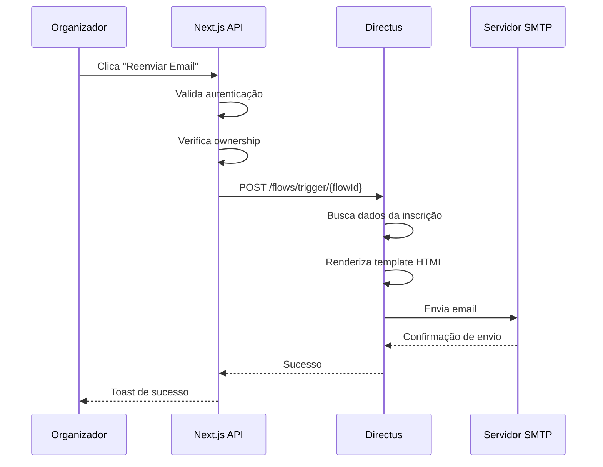

# 📧 Integração de Email via Directus Flow

Este documento explica como o sistema de reenvio de emails funciona usando Directus Flows.

## 📋 Visão Geral

O envio de emails de confirmação é gerenciado pelo **Directus através de Flows**, não pelo Next.js. Isso oferece várias vantagens:

✅ **Templates visuais**: Edite o email sem mexer em código
✅ **Logs automáticos**: Rastreie todos os envios no Directus Admin
✅ **Reutilizável**: O mesmo flow pode ser usado em outros lugares
✅ **Manutenção fácil**: Ajustes no template sem deploy do Next.js

---

## 🔧 Configuração do SMTP no Directus

### 1. Arquivo `.env` do Directus

```env
# Email Configuration
EMAIL_FROM=noreply@yourdomain.com
EMAIL_TRANSPORT=smtp
EMAIL_SMTP_HOST=smtp.gmail.com
EMAIL_SMTP_PORT=587
EMAIL_SMTP_USER=your-email@gmail.com
EMAIL_SMTP_PASSWORD=your-app-password
EMAIL_SMTP_SECURE=false
```

### 2. Opções de Provedores SMTP

#### **Gmail** (Desenvolvimento)
1. Ativar autenticação em 2 fatores
2. Criar senha de aplicativo em: https://myaccount.google.com/apppasswords
3. Usar essa senha no `EMAIL_SMTP_PASSWORD`

#### **Mailtrap** (Testes)
- Gratuito para desenvolvimento
- Não envia emails reais (ideal para testes)
- https://mailtrap.io/inboxes

#### **SendGrid** / **Resend** / **AWS SES** (Produção)
- Configurar via SMTP ou API
- Melhor entregabilidade
- Relatórios detalhados

---

## 🎯 Arquitetura do Flow

### **Flow ID**: `4e7ce624-bc73-44eb-9fda-20b6cd609f74`

**Nome**: `[TESTE] Reenviar Email` (Flow funcional)

### Operações:

#### **Operação 1: Buscar Dados** (`read_registration`)
- **Tipo**: `item-read`
- **Coleção**: `event_registrations`
- **Input**: `{{ $trigger.body.registration_id }}`
- **Busca**:
  - Dados do participante
  - Detalhes do evento
  - Informações do ingresso
  - Código único do ticket

#### **Operação 2: Enviar Email** (`send_confirmation_email`)
- **Tipo**: `mail`
- **Destinatário**: `{{ read_registration.participant_email }}`
- **Assunto**: `Confirmação de Inscrição - {{ read_registration.event_id.title }}`
- **Corpo**: HTML formatado com:
  - Nome do participante
  - Detalhes do evento (data, local, endereço)
  - Tipo de ingresso
  - **Código único em destaque**
  - Informações adicionais

---

## 🔗 Como Chamar o Flow do Next.js

### Código da API Route

```typescript
// src/app/api/admin/participantes/[id]/resend-email/route.ts

const RESEND_EMAIL_FLOW_ID = '4e7ce624-bc73-44eb-9fda-20b6cd609f74'; // Flow funcional
const DIRECTUS_URL = process.env.NEXT_PUBLIC_DIRECTUS_URL || 'http://localhost:8055';

// Trigger flow usando REST API do Directus
const flowResponse = await fetch(`${DIRECTUS_URL}/flows/trigger/${RESEND_EMAIL_FLOW_ID}`, {
  method: 'POST',
  headers: {
    'Content-Type': 'application/json',
    'Authorization': `Bearer ${token}`,
  },
  body: JSON.stringify({
    registration_id: registrationId,
  }),
});

if (!flowResponse.ok) {
  const errorData = await flowResponse.json().catch(() => ({}));
  throw new Error(errorData.errors?.[0]?.message || 'Erro ao executar flow do Directus');
}
```

### Fluxo Completo



---

## 🎨 Personalizando o Template

### Via Directus Admin

1. Acesse: **Settings → Flows**
2. Encontre: `[Participantes] Reenviar Email de Confirmação`
3. Clique na operação: `Enviar Email de Confirmação`
4. Edite o campo `Body` com HTML

### Variáveis Disponíveis (Handlebars)

```handlebars
{{! Dados do Participante }}
{{ read_registration.participant_name }}
{{ read_registration.participant_email }}
{{ read_registration.ticket_code }}

{{! Dados do Evento }}
{{ read_registration.event_id.title }}
{{ read_registration.event_id.start_date }}
{{ read_registration.event_id.location_name }}
{{ read_registration.event_id.location_address }}

{{! Dados do Ingresso }}
{{ read_registration.ticket_type_id.title }}
{{ read_registration.ticket_type_id.price }}

{{! Condicionais }}
{{#if read_registration.event_id.location_address}}
  <p>Endereço: {{ read_registration.event_id.location_address }}</p>
{{/if}}
```

### Exemplo de Template Customizado

```html
<div style="font-family: Arial, sans-serif; max-width: 600px; margin: 0 auto;">
  <div style="background: #2563eb; padding: 20px; text-align: center;">
    <h1 style="color: white; margin: 0;">🎉 Confirmação de Inscrição</h1>
  </div>

  <div style="padding: 20px; background: #f9fafb;">
    <h2>Olá, {{ read_registration.participant_name }}!</h2>

    <p>Sua inscrição para <strong>{{ read_registration.event_id.title }}</strong> foi confirmada!</p>

    <div style="background: white; padding: 16px; border-radius: 8px; margin: 20px 0;">
      <h3 style="margin-top: 0;">📅 Detalhes do Evento</h3>
      <ul style="list-style: none; padding: 0;">
        <li><strong>Data:</strong> {{ read_registration.event_id.start_date }}</li>
        <li><strong>Local:</strong> {{ read_registration.event_id.location_name }}</li>
        <li><strong>Ingresso:</strong> {{ read_registration.ticket_type_id.title }}</li>
      </ul>
    </div>

    <div style="background: #eff6ff; padding: 20px; border-radius: 8px; text-align: center; margin: 20px 0;">
      <p style="margin: 0; color: #6b7280; font-size: 14px;">Código do Ingresso:</p>
      <p style="font-family: 'Courier New', monospace; font-size: 32px; font-weight: bold; color: #2563eb; margin: 10px 0;">
        {{ read_registration.ticket_code }}
      </p>
      <p style="margin: 0; color: #6b7280; font-size: 12px;">
        Apresente este código no check-in
      </p>
    </div>
  </div>

  <div style="background: #e5e7eb; padding: 16px; text-align: center;">
    <p style="margin: 0; color: #6b7280; font-size: 12px;">
      Este é um email automático. Por favor, não responda.
    </p>
  </div>
</div>
```

---

## 🧪 Testando o Envio

### 1. Via Interface Admin do Next.js

1. Acesse `/admin/participantes`
2. Clique no menu de ações (⋮) de um participante
3. Selecione "Reenviar email"
4. Confirme o envio

### 2. Via Directus Admin (Teste Direto)

1. Acesse Directus Admin: http://localhost:8055/admin
2. Vá em **Settings → Flows**
3. Clique em `[Participantes] Reenviar Email de Confirmação`
4. Clique em **"Run Flow"** (canto superior direito)
5. Insira um payload de teste:

```json
{
  "registration_id": "uuid-da-inscricao-aqui"
}
```

### 3. Logs de Execução

**No Directus Admin:**
- **Settings → Flows → [Flow] → Activity**
- Veja todas as execuções, sucessos e erros

**No Next.js:**
```bash
# Console logs mostram detalhes do envio
docker compose logs -f
```

---

## 🚨 Troubleshooting

### Email não está sendo enviado

**1. Verificar configuração SMTP**
```bash
# No Directus container
docker compose exec directus env | grep EMAIL
```

**2. Testar conexão SMTP**
```bash
# Via telnet
telnet smtp.gmail.com 587
```

**3. Verificar logs do Directus**
```bash
docker compose logs directus | grep -i mail
```

### Erro: "Invalid flow ID"

- Confirme que o `RESEND_EMAIL_FLOW_ID` no código está correto
- Verifique se o flow está ativo no Directus Admin

### Erro: "Permission denied"

- O usuário precisa ter permissão para executar flows
- Verifique as permissões do role no Directus

### Template não renderiza variáveis

- Certifique-se de usar a sintaxe correta: `{{ variable }}`
- Variáveis devem corresponder aos dados retornados pela operação `read_registration`
- Use `{{#if}}` para condicionais

---

## 📈 Melhorias Futuras

### 1. Adicionar QR Code ao Email

```javascript
// Operation: exec (antes do send_confirmation_email)
module.exports = async function(data) {
  const QRCode = require('qrcode');

  const qrCodeDataURL = await QRCode.toDataURL(data.read_registration.ticket_code);

  return {
    ...data.read_registration,
    qr_code: qrCodeDataURL
  };
}
```

Depois usar no template:
```html

```

### 2. Templates por Tipo de Evento

Criar flows diferentes para cada tipo de evento:
- `[Participantes] Email - Evento Presencial`
- `[Participantes] Email - Evento Online`
- `[Participantes] Email - Evento Híbrido`

### 3. Email de Cancelamento

Criar flow similar para enviar email quando inscrição é cancelada:
- Informar sobre o cancelamento
- Fornecer informações sobre reembolso (se aplicável)
- Link para suporte

### 4. Emails Transacionais Adicionais

- Email de boas-vindas na primeira inscrição
- Lembretes antes do evento (7 dias, 1 dia)
- Email pós-evento com feedback

---

## 🔐 Segurança

### Boas Práticas

1. **Nunca exponha credenciais SMTP no frontend**
   - Sempre use variáveis de ambiente
   - `EMAIL_SMTP_PASSWORD` deve estar apenas no servidor

2. **Validar ownership antes de enviar**
   - O código já verifica se o organizador é dono do evento
   - Nunca permitir envio arbitrário de emails

3. **Rate limiting**
   - Considere limitar número de reenvios por inscrição
   - Prevenir abuse do sistema de email

4. **Email válido**
   - Sempre validar formato de email antes de enviar
   - Tratar bounces e emails inválidos

---

## 📚 Referências

- [Directus Flows Documentation](https://docs.directus.io/app/flows.html)
- [Directus Mail Operation](https://docs.directus.io/app/flows/operations.html#send-email)
- [Handlebars Template Syntax](https://handlebarsjs.com/)
- [SMTP Configuration Guide](https://docs.directus.io/self-hosted/config-options.html#email)

---

**Última atualização**: 2025-10-10
**Versão do Directus**: 11.x
**Versão do Next.js**: 15.2.4
