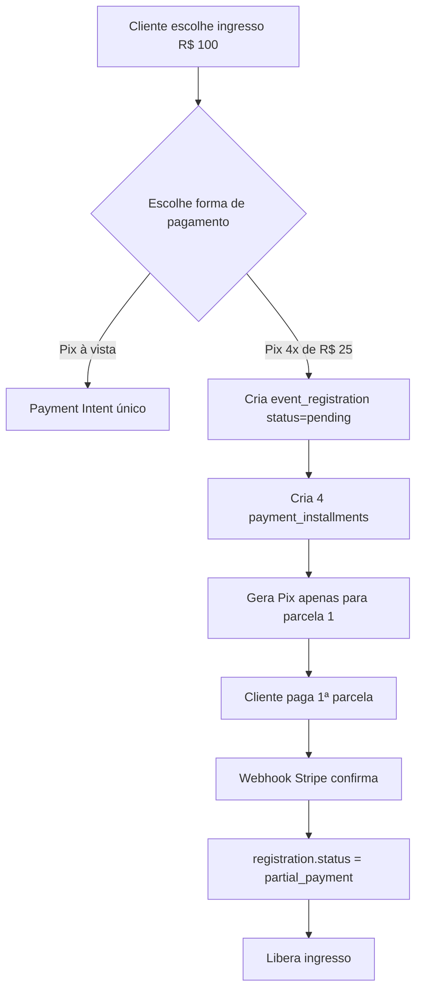
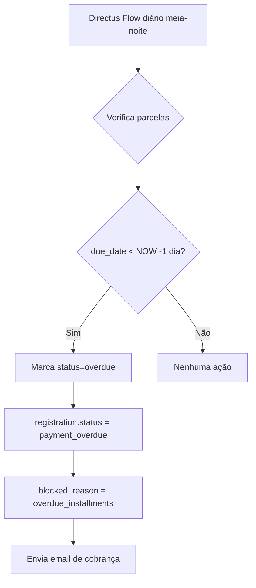
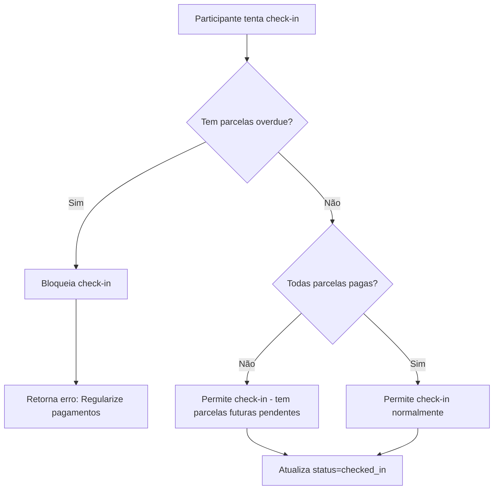
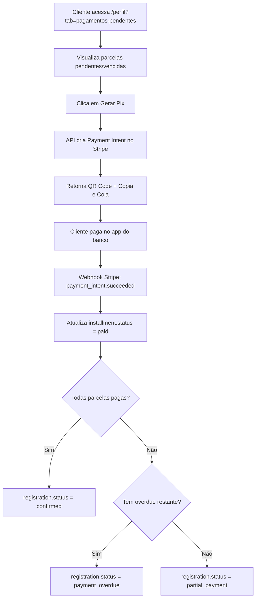

# Especificação: Sistema de Pix Parcelado Customizado

**Versão:** 1.0
**Data:** 2025-10-10
**Autor:** Sistema de Eventos - Thiago Pereira
**Status:** 📋 Em Planejamento

---

## 📌 Resumo Executivo

Implementação de um sistema próprio de parcelamento via Pix para compra de ingressos, onde cada parcela é um pagamento Pix separado gerenciado pela plataforma. O sistema permitirá que clientes comprem ingressos parcelando o valor em até 4x via Pix, pagando a primeira parcela no ato da compra e as demais conforme vencimento.

---

## 🎯 Objetivos

### Objetivo Principal
Permitir que usuários comprem ingressos de eventos com pagamento parcelado via Pix, aumentando a conversão de vendas e acessibilidade financeira.

### Objetivos Específicos
- ✅ Permitir parcelamento de ingressos em até 4x via Pix
- ✅ Garantir pagamento da primeira parcela antes de liberar o ingresso
- ✅ Bloquear check-in de participantes com parcelas vencidas
- ✅ Automatizar notificações de cobrança e vencimento
- ✅ Fornecer interface para usuários visualizarem e pagarem parcelas pendentes

---

## 🔍 Contexto Técnico

### Limitação do Stripe
O Stripe não oferece "Pix Parcelado" nativamente. O Pix do Stripe funciona apenas para pagamentos à vista instantâneos.

### Solução Proposta
Criar um sistema customizado onde:
- Cada parcela = 1 Payment Intent do Stripe (Pix à vista)
- A plataforma gerencia o calendário de vencimentos
- Cliente gera manualmente o Pix para cada parcela quando desejar pagar
- Sistema automatiza cobranças e bloqueios por inadimplência

---

## 🏗️ Arquitetura

### Nova Collection: `payment_installments`

```typescript
{
  id: uuid (PK)
  registration_id: uuid (FK -> event_registrations)

  // Controle de Parcelas
  installment_number: integer       // 1, 2, 3, 4
  total_installments: integer       // 4

  // Valores
  amount: decimal                   // R$ 25,00 (por parcela)
  due_date: date                    // Data de vencimento

  // Status da Parcela
  status: string                    // 'pending', 'paid', 'overdue', 'cancelled'

  // Integração Stripe
  stripe_payment_intent_id: string  // ID do Payment Intent
  pix_qr_code_base64: text          // QR Code em base64
  pix_copy_paste: text              // Código Pix copia e cola

  // Auditoria
  paid_at: timestamp
  payment_confirmed_at: timestamp
  date_created: timestamp
  date_updated: timestamp
}
```

### Modificações em Collections Existentes

**`event_tickets`**
```typescript
{
  // Novos campos:
  allow_installments: boolean
  max_installments: integer         // Máximo de parcelas (ex: 4)
  min_amount_for_installments: decimal  // Valor mínimo para parcelar
}
```

**`event_registrations`**
```typescript
{
  // Novos campos:
  is_installment_payment: boolean
  total_installments: integer
  installment_plan_status: string   // 'active', 'completed', 'defaulted'
  blocked_reason: string            // 'overdue_installments', null

  // Modificação de status:
  status: string // Novos valores:
  // - 'pending' → Aguardando 1º pagamento
  // - 'partial_payment' → 1ª parcela paga, tem parcelas pendentes
  // - 'payment_overdue' → Tem parcelas vencidas (>1 dia)
  // - 'confirmed' → Totalmente pago
  // - 'cancelled' → Cancelado
  // - 'checked_in' → Check-in realizado
}
```

---

## 🔄 Fluxos de Processo

### 1. Fluxo de Compra (Checkout)



### 2. Fluxo de Vencimento e Cobrança



### 3. Fluxo de Check-in



### 4. Fluxo de Pagamento de Parcela



---

## 🚀 Plano de Implementação

### Fase 1: Backend - Schema Directus (2-3 dias)

**1.1 Criar Collection `payment_installments`**
- Criar collection com todos os campos especificados
- Configurar relação M2O com `event_registrations`
- Adicionar ícone e configurações de UI

**1.2 Modificar `event_tickets`**
- Adicionar campo `allow_installments` (boolean)
- Adicionar campo `max_installments` (integer, default: 4)
- Adicionar campo `min_amount_for_installments` (decimal)

**1.3 Modificar `event_registrations`**
- Adicionar campos de controle de parcelamento
- Atualizar choices do campo `status`
- Adicionar campos `blocked_reason`, `installment_plan_status`

**1.4 Gerar TypeScript Types**
- Executar `pnpm generate:types`
- Validar tipos no projeto Next.js

---

### Fase 2: Backend - API Routes Next.js (4-5 dias)

**2.1 API: Checkout com Parcelamento**
- Criar `/api/checkout/installments/route.ts`
- Lógica de criação de registration + installments
- Criar primeiro Payment Intent (parcela 1)
- Retornar QR Code + copia/cola

**2.2 API: Gerar Pix para Parcela**
- Criar `/api/installments/[id]/generate-pix/route.ts`
- Validar se parcela existe e não foi paga
- Criar Payment Intent no Stripe
- Salvar dados do Pix no Directus

**2.3 API: Webhook Handler (Atualização)**
- Modificar `/api/stripe/webhook/route.ts`
- Adicionar lógica para `installment_id` no metadata
- Implementar atualização de status de registration baseado em parcelas
- Tratar casos: all paid, has overdue, has pending

**2.4 API: Check-in (Atualização)**
- Modificar `/api/events/[id]/check-in/route.ts`
- Validar se tem parcelas overdue
- Bloquear check-in se necessário
- Retornar mensagem de erro apropriada

**2.5 API: Listar Pagamentos Pendentes**
- Criar `/api/my-registrations/route.ts`
- Filtrar registrations do usuário logado
- Incluir installments relacionados
- Retornar apenas registrations com parcelas pendentes/overdue

---

### Fase 3: Automação - Directus Flow (2 dias)

**3.1 Flow: Marcar Parcelas Vencidas**
- Criar flow com trigger schedule (cron: diário à meia-noite)
- Operation 1: Buscar parcelas com `status=pending` e `due_date < NOW(-1 day)`
- Operation 2: Atualizar status para `overdue`
- Operation 3: Atualizar registration para `payment_overdue`
- Operation 4: Enviar email de cobrança

**3.2 Flow: Lembrete de Vencimento (Opcional)**
- Flow com trigger schedule (cron: diário)
- Buscar parcelas com vencimento em 3 dias
- Enviar email de lembrete preventivo

---

### Fase 4: Frontend - UI/UX (5-6 dias)

**4.1 Página de Checkout - Opção de Parcelamento**
- Modificar componente de checkout existente
- Adicionar radio button: "Pix à vista" vs "Pix parcelado"
- Exibir simulação de parcelas
- Integrar com API de checkout

**4.2 Página: Pagamentos Pendentes**
- Criar `/app/(authenticated)/perfil/components/PendingPayments.tsx`
- Listar registrations com parcelas pendentes
- Exibir status: pendente, vencido, dias de atraso
- Botão "Gerar Pix" por parcela
- Exibir QR Code + Copia e Cola
- Alertas visuais para parcelas vencidas

**4.3 Tab no Perfil do Usuário**
- Adicionar tab "Pagamentos Pendentes" em `/perfil`
- Integrar componente `PendingPayments`
- Badge com contador de parcelas vencidas

**4.4 Página de Ingresso - Status de Pagamento**
- Atualizar exibição do ingresso
- Mostrar status: "Pago", "Parcialmente Pago", "Pagamento Vencido"
- Link para página de pagamentos pendentes
- Alertas de bloqueio de check-in

**4.5 Área de Check-in - Bloqueio Visual**
- Adicionar validação no componente de check-in
- Exibir mensagem de erro se tiver overdue
- Link direto para regularizar pagamentos

---

### Fase 5: Testes e Validação (3-4 dias)

**5.1 Testes de Integração**
- Testar fluxo completo de checkout parcelado
- Testar geração de Pix para parcelas
- Testar webhook do Stripe
- Testar flow de overdue

**5.2 Testes de Regras de Negócio**
- Validar bloqueio de check-in com overdue
- Validar desbloqueio após pagamento
- Validar transição de status corretamente

**5.3 Testes de Stripe (Sandbox)**
- Simular pagamentos de parcelas
- Testar expiração de Pix (24h)
- Testar regeneração de Pix

**5.4 Testes de UX**
- Validar fluxo do usuário
- Testar em dispositivos móveis
- Verificar clareza de mensagens

---

### Fase 6: Deploy e Monitoramento (1-2 dias)

**6.1 Deploy Staging**
- Deploy do Directus (schema)
- Deploy do Next.js
- Configurar webhooks do Stripe para staging

**6.2 Testes em Produção Simulada**
- Testar com dados reais (valores baixos)
- Validar emails de cobrança
- Verificar logs

**6.3 Deploy Produção**
- Migração de schema do Directus
- Deploy Next.js para produção
- Atualizar webhooks do Stripe
- Monitorar logs nas primeiras 24h

**6.4 Documentação**
- Documentar API endpoints
- Criar guia de uso para administradores
- Criar FAQ para usuários

---

## ⚠️ Regras de Negócio

### Status de Registration

| Status | Descrição | Permite Check-in? |
|--------|-----------|-------------------|
| `pending` | Aguardando 1º pagamento | ❌ Não |
| `partial_payment` | 1ª parcela paga, tem parcelas futuras pendentes | ✅ Sim |
| `payment_overdue` | Tem parcelas vencidas (>1 dia) | ❌ Não |
| `confirmed` | Totalmente pago | ✅ Sim |
| `checked_in` | Já fez check-in | ✅ N/A |
| `cancelled` | Cancelado | ❌ Não |

### Vencimento de Parcelas
- **Após 1 dia de atraso**: Parcela marcada como `overdue`
- **Registration bloqueado**: `status = payment_overdue`
- **Email enviado**: Notificação de cobrança automática

### Check-in
- ✅ **Permite**: Se todas parcelas estão `paid` ou `pending` (não vencidas)
- ❌ **Bloqueia**: Se qualquer parcela está `overdue`
- 📧 **Mensagem**: "Você possui parcelas vencidas. Regularize os pagamentos para fazer check-in."

### Geração de Pix
- Pode gerar Pix para parcela a qualquer momento
- Pix expira em 24h (padrão Stripe)
- Pode regenerar Pix quantas vezes precisar
- Não pode gerar Pix para parcela já paga

---

## 🎨 Wireframes e UX

### Checkout - Seleção de Pagamento

```
┌─────────────────────────────────────────┐
│ Ingresso: VIP - R$ 100,00               │
├─────────────────────────────────────────┤
│ Forma de Pagamento:                     │
│                                         │
│ ○ Pix à vista - R$ 100,00              │
│                                         │
│ ◉ Pix parcelado em até 4x              │
│   └─ 4x de R$ 25,00                    │
│      1ª parcela hoje + 3x mensais      │
│                                         │
│ [ Finalizar Compra ]                   │
└─────────────────────────────────────────┘
```

### Perfil - Pagamentos Pendentes

```
┌─────────────────────────────────────────────────────┐
│ 🎟️ Ingresso: Festival de Música 2025               │
│                                                     │
│ ⚠️ ATENÇÃO: Você possui parcelas vencidas          │
│    Seu check-in está bloqueado até regularização   │
│                                                     │
├─────────────────────────────────────────────────────┤
│ Parcela 2/4                                         │
│ Vencimento: 10/09/2025                              │
│ 🔴 Vencida há 5 dias          R$ 25,00              │
│ [ 🚨 Pagar Parcela Vencida ]                        │
├─────────────────────────────────────────────────────┤
│ Parcela 3/4                                         │
│ Vencimento: 10/10/2025                              │
│ 🟡 Pendente                   R$ 25,00              │
│ [ Gerar Pix para Pagamento ]                        │
├─────────────────────────────────────────────────────┤
│ Parcela 4/4                                         │
│ Vencimento: 10/11/2025                              │
│ 🟡 Pendente                   R$ 25,00              │
│ [ Gerar Pix para Pagamento ]                        │
└─────────────────────────────────────────────────────┘
```

---

## 💰 Considerações Financeiras

### Custos do Stripe
- **Taxa Pix**: ~3.99% por transação
- **4 parcelas** = 4 transações = 4x a taxa
- **Exemplo**: Ingresso R$ 100,00
  - Taxa total: ~R$ 15,96
  - Com à vista: ~R$ 3,99

### Recomendações
- Considerar repassar parte da taxa para parcelamento
- Ou definir valor mínimo para parcelamento (ex: R$ 50,00)
- Transparência com o cliente sobre custos

---

## 🔐 Segurança

### Validações Importantes
- ✅ Verificar se usuário é dono da registration antes de gerar Pix
- ✅ Validar webhook signature do Stripe
- ✅ Prevenir criação duplicada de Payment Intent
- ✅ Rate limiting em endpoints de geração de Pix

### Dados Sensíveis
- Não armazenar dados de pagamento além do Stripe
- QR Code pode ser armazenado (é temporário, expira em 24h)
- Logs devem omitir informações sensíveis

---

## 📊 Métricas de Sucesso

### KPIs
- Taxa de conversão com parcelamento vs à vista
- Taxa de inadimplência (% de parcelas overdue)
- Tempo médio para regularização de parcela vencida
- % de check-ins bloqueados por inadimplência

### Monitoramento
- Dashboard no Directus com métricas de parcelas
- Alertas para taxa de inadimplência > 10%
- Relatório mensal de parcelas pendentes

---

## 🚧 Limitações Conhecidas

### Limitações Técnicas
- ❌ Pix expira em 24h (não é possível estender)
- ❌ Não há débito automático (cliente precisa pagar manualmente)
- ❌ Stripe tem limite de R$ 1.000 por transação Pix
- ❌ Limite mensal de R$ 10.000 por comprador

### Limitações de Negócio
- Risco de inadimplência
- Custo operacional de cobrança
- Experiência não é tão fluida quanto parcelamento no cartão

---

## 📚 Referências Técnicas

### Documentação Stripe
- [Stripe Pix Payments](https://docs.stripe.com/payments/pix)
- [Payment Intents API](https://docs.stripe.com/api/payment_intents)
- [Webhooks](https://docs.stripe.com/webhooks)

### Arquivos do Projeto
- `/nextjs/src/lib/stripe/` - Integração Stripe
- `/nextjs/src/app/api/stripe/webhook/route.ts` - Webhook handler
- `/directus/.env` - Configurações Directus

---

## 📝 Notas Adicionais

### Melhorias Futuras (v2)
- [ ] Integração com WhatsApp para cobranças
- [ ] Débito automático via Pix (quando Stripe suportar)
- [ ] Sistema de score de crédito interno
- [ ] Descontos para pagamento antecipado
- [ ] Renegociação de parcelas vencidas

### Alternativas Consideradas
- ❌ Múltiplos gateways (Mercado Pago): Complexidade alta, manutenção dobrada
- ❌ Cartão parcelado apenas: Exclui público sem cartão
- ✅ Sistema próprio com Pix: Maior controle, aproveita Stripe existente

---

**Documento criado por:** Claude Code
**Última atualização:** 2025-10-10
**Próxima revisão:** Após implementação da Fase 1
