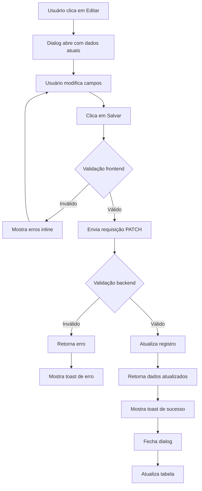
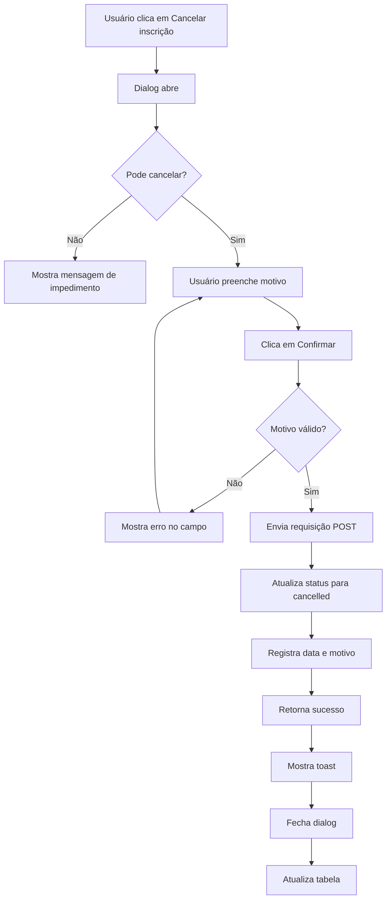

# Especificação: Melhorias na Página de Gerenciamento de Participantes

**Versão:** 1.0
**Data:** 10/10/2025
**Status:** Proposta
**Localização:** `/admin/participantes`

## 1. Visão Geral

Este documento especifica as melhorias necessárias para a página de gerenciamento de participantes do painel administrativo. O objetivo é fornecer funcionalidades completas de CRUD (Create, Read, Update, Delete) e melhorar a experiência do organizador ao gerenciar inscrições de eventos.

### 1.1 Contexto

Atualmente a página de gerenciamento de participantes oferece:
- ✅ Visualização de participantes em tabela/cards
- ✅ Filtros avançados (evento, tipo de ingresso, status)
- ✅ Busca por nome/email/código
- ✅ Check-in/desfazer check-in
- ✅ Exportação para CSV
- ✅ Métricas em tempo real

Funcionalidades pendentes (identificadas no código mas não implementadas):
- ❌ Edição de participante
- ❌ Reenvio de email de confirmação
- ❌ Cancelamento de inscrição
- ❌ Filtro por data range de check-in
- ❌ Ordenação por coluna

---

## 2. Requisitos Funcionais

### RF-01: Edição de Participante

**Descrição:**
Permitir que organizadores editem informações básicas de um participante.

**Comportamento:**
- Acessível via dropdown de ações (ícone três pontos) na linha da tabela
- Abre um modal/dialog de edição
- Permite editar:
  - Nome do participante
  - Email
  - Telefone
  - Documento de identificação (se aplicável)
  - Observações/notas internas
- **NÃO** permite alterar:
  - Evento associado
  - Tipo de ingresso
  - Quantidade
  - Valores pagos
  - Status de pagamento
  - Dados de check-in

**Validações:**
- Email deve ser válido (formato)
- Nome é obrigatório
- Telefone deve seguir formato brasileiro (se preenchido)
- Verificar se email já está em uso por outro participante do mesmo evento

**Fluxo:**
1. Usuário clica em "Editar" no dropdown de ações
2. Dialog de edição abre com dados atuais pré-preenchidos
3. Usuário modifica campos desejados
4. Clica em "Salvar"
5. Sistema valida dados
6. Se válido: atualiza registro, mostra toast de sucesso, fecha dialog, atualiza tabela
7. Se inválido: mostra mensagens de erro inline nos campos

**Permissões:**
- Apenas organizadores podem editar participantes de seus próprios eventos

---

### RF-02: Reenvio de Email de Confirmação

**Descrição:**
Permitir reenviar o email de confirmação de inscrição para o participante.

**Comportamento:**
- Acessível via dropdown de ações
- Ao clicar, mostra dialog de confirmação
- Dialog exibe:
  - Nome e email do destinatário
  - Tipo de email que será enviado (confirmação de inscrição)
  - Aviso se houver algum impedimento (ex: inscrição cancelada)
- Após confirmação, envia email e mostra toast de feedback

**Validações:**
- Inscrição não pode estar cancelada
- Email do participante deve estar válido
- Verificar se sistema de email está configurado

**Fluxo:**
1. Usuário clica em "Reenviar email" no dropdown
2. Dialog de confirmação abre
3. Sistema verifica impedimentos
4. Se houver impedimento: mostra mensagem de aviso
5. Se não houver: usuário confirma envio
6. Sistema envia email via API do Directus
7. Mostra toast de sucesso ou erro
8. Fecha dialog

**Casos Especiais:**
- Inscrição cancelada: mostrar aviso mas permitir reenvio (para casos de reativação)
- Email inválido: não permitir reenvio, sugerir edição do participante
- Falha no envio: mostrar erro específico com opção de tentar novamente

---

### RF-03: Cancelamento de Inscrição

**Descrição:**
Permitir que organizadores cancelem inscrições de participantes.

**Comportamento:**
- Acessível via dropdown de ações (item em vermelho)
- Ao clicar, abre dialog de confirmação com aviso de ação destrutiva
- Dialog exibe:
  - Nome do participante
  - Detalhes da inscrição (evento, ingresso, valor)
  - Status de pagamento
  - Aviso sobre consequências do cancelamento
  - Campo de texto para motivo do cancelamento (obrigatório)

**Validações:**
- Apenas inscrições com status "confirmed" ou "pending" podem ser canceladas
- Inscrições já canceladas não podem ser canceladas novamente
- Motivo do cancelamento é obrigatório (mínimo 10 caracteres)

**Fluxo:**
1. Usuário clica em "Cancelar inscrição" no dropdown
2. Dialog de confirmação abre
3. Sistema verifica se pode cancelar
4. Se não pode: mostra mensagem explicativa
5. Se pode: usuário preenche motivo e confirma
6. Sistema atualiza status para "cancelled"
7. Sistema registra data/hora do cancelamento
8. Sistema registra motivo do cancelamento
9. (Futuro) Sistema pode disparar email de notificação ao participante
10. Mostra toast de sucesso
11. Fecha dialog e atualiza tabela

**Impactos:**
- Status da inscrição muda para "cancelled"
- Check-in é desabilitado (se houver)
- Inscrição continua visível nas listagens (com filtro de status)
- Não afeta dados de pagamento (reembolso é processo separado)

**Regras de Negócio:**
- Cancelamento não gera reembolso automático
- Organizador deve processar reembolso manualmente via Stripe (se aplicável)
- Cancelamento é irreversível (não há "descancelar")
- Reativação requer nova inscrição

---

### RF-04: Filtro por Data Range de Check-in

**Descrição:**
Adicionar filtro para buscar participantes que fizeram check-in em um período específico.

**Comportamento:**
- Novo filtro no painel de filtros lateral (ParticipantFilters)
- Componente de date range picker (dois campos: início e fim)
- Filtro independente dos demais
- Permite filtrar apenas por data de início, apenas fim, ou ambos

**Interface:**
```
[ ] Check-in realizado entre:
    De: [___/___/___]
    Até: [___/___/___]
    [Limpar datas]
```

**Validações:**
- Data de início não pode ser posterior à data de fim
- Datas não podem ser futuras
- Formato: DD/MM/YYYY

**Fluxo:**
1. Usuário abre painel de filtros
2. Seleciona data de início e/ou fim
3. Clica em "Aplicar filtros"
4. Sistema adiciona filtro à query
5. Badge do filtro aparece na área de filtros ativos
6. Tabela atualiza com resultados filtrados

**Integração Técnica:**
- Adicionar campos `checkInStart` e `checkInEnd` aos query params da API
- Backend filtra registros onde `check_in_date` está no intervalo
- Usar componente de date picker da biblioteca Shadcn/ui

---

### RF-05: Ordenação por Coluna na Tabela

**Descrição:**
Permitir que usuários ordenem a tabela clicando nos cabeçalhos das colunas.

**Comportamento:**
- Ícone de ordenação (setas) aparece ao lado do título da coluna ao passar mouse
- Primeiro clique: ordena ascendente (seta para cima destacada)
- Segundo clique: ordena descendente (seta para baixo destacada)
- Terceiro clique: remove ordenação (volta ao padrão)
- Apenas uma coluna pode ser ordenada por vez
- Ordenação persiste ao trocar de página

**Colunas Ordenáveis:**
- ✅ Participante (por nome)
- ✅ Evento (por título)
- ✅ Tipo de Ingresso (por título)
- ✅ Pagamento (por status, depois por valor)
- ✅ Check-in (por data, NULL por último)
- ❌ Ações (não ordenável)
- ❌ Select checkbox (não ordenável)

**Interface:**
```
Participante ↕️    Evento ↕️    Ingresso ↕️    Pagamento ↕️    Check-in ↑
```

**Fluxo:**
1. Usuário clica no cabeçalho de uma coluna ordenável
2. Tabela mostra estado de loading
3. Sistema envia requisição com parâmetros `sortField` e `sortDirection`
4. Backend ordena resultados
5. Tabela atualiza com dados ordenados
6. Indicador visual mostra coluna e direção ativa

**Implementação Técnica:**
- TanStack Table já suporta ordenação
- Modificar colunas para incluir propriedade `enableSorting: true`
- Adicionar handler `onSortingChange` à tabela
- Enviar params `sortField` e `sortDirection` à API
- Backend aplica ordenação no Directus SDK usando campo `sort`

**Casos Especiais:**
- Colunas com dados relacionais (evento, ingresso): ordenar pelo campo de título do relacionamento
- Valores NULL: sempre aparecem por último, independente da direção
- Ordenação + filtros: ambos funcionam simultaneamente
- Ordenação + busca: ambos funcionam simultaneamente

---

## 3. Requisitos Não-Funcionais

### RNF-01: Performance
- Operações de edição devem completar em < 2s
- Filtros e ordenação não devem adicionar mais de 500ms ao tempo de resposta
- Reenvio de email deve ser assíncrono (não bloquear UI)

### RNF-02: Usabilidade
- Feedbacks visuais claros para todas as ações (toasts)
- Estados de loading visíveis durante operações assíncronas
- Confirmações para ações destrutivas (cancelamento)
- Validações inline em formulários
- Interface responsiva (mobile-friendly)

### RNF-03: Segurança
- Todas as operações requerem autenticação
- Verificação de ownership (organizador só manipula seus eventos)
- Validação de dados no frontend e backend
- Proteção contra CSRF (tokens)
- Logs de auditoria para ações administrativas

### RNF-04: Acessibilidade
- Navegação por teclado funcional
- Labels adequados em campos de formulário
- Contraste adequado de cores (WCAG AA)
- Feedback de leitores de tela

---

## 4. Design de Interface (UX)

### 4.1 Estrutura de Dialogs

Todos os dialogs seguem o mesmo padrão visual:

**Anatomia:**
```
┌─────────────────────────────────────┐
│ [Ícone] Título do Dialog      [X]   │
│ Descrição breve da ação             │
├─────────────────────────────────────┤
│                                     │
│   [Conteúdo Principal]              │
│   • Campos de formulário            │
│   • Informações de contexto         │
│   • Avisos/alertas                  │
│                                     │
├─────────────────────────────────────┤
│             [Cancelar] [Confirmar]  │
└─────────────────────────────────────┘
```

### 4.2 Dialog de Edição

**Título:** "Editar Participante"
**Ícone:** Pencil (lucide-react)

**Campos:**
```
Nome completo *
[___________________________________]

Email *
[___________________________________]

Telefone
[___________________________________]
Formato: (XX) XXXXX-XXXX

Documento
[___________________________________]
CPF ou RG

Observações
[___________________________________]
[___________________________________]
Notas internas visíveis apenas para você
```

**Botões:**
- Cancelar (variant: outline)
- Salvar (variant: default, cor primária)

**Estados:**
- Normal
- Loading (botão com spinner + desabilitado)
- Erro (mensagens inline nos campos)

### 4.3 Dialog de Reenvio de Email

**Título:** "Reenviar Email de Confirmação"
**Ícone:** Mail (lucide-react)

**Conteúdo:**
```
┌──────────────────────────────────────────┐
│ Email será enviado para:                 │
│                                          │
│ 📧 participante@email.com                │
│                                          │
│ ℹ️ O email conterá:                      │
│   • Confirmação da inscrição             │
│   • Código do ingresso                   │
│   • Informações do evento                │
│   • QR Code para check-in                │
│                                          │
│ ⚠️ Inscrição cancelada                   │
│ Esta inscrição foi cancelada. O email   │
│ ainda pode ser enviado, mas o ingresso   │
│ não será válido para check-in.           │
└──────────────────────────────────────────┘
```

**Botões:**
- Cancelar (variant: outline)
- Enviar Email (variant: default, ícone: Send)

### 4.4 Dialog de Cancelamento

**Título:** "Cancelar Inscrição"
**Ícone:** AlertTriangle (lucide-react, cor vermelha)

**Conteúdo:**
```
┌──────────────────────────────────────────┐
│ ⚠️ Atenção: Esta ação não pode ser       │
│ desfeita!                                │
│                                          │
│ Participante: João Silva                 │
│ Evento: Workshop de React 2025           │
│ Ingresso: Premium (R$ 350,00)            │
│ Status Pagamento: Pago                   │
│                                          │
│ Ao cancelar esta inscrição:              │
│ • O participante não poderá fazer        │
│   check-in                               │
│ • O ingresso ficará inválido             │
│ • Reembolso deve ser processado          │
│   manualmente via Stripe                 │
│                                          │
│ Motivo do cancelamento *                 │
│ [_________________________________]       │
│ [_________________________________]       │
│ [_________________________________]       │
│ Mínimo 10 caracteres                     │
└──────────────────────────────────────────┘
```

**Botões:**
- Voltar (variant: outline)
- Confirmar Cancelamento (variant: destructive, cor vermelha)

### 4.5 Filtro de Data Range

**Localização:** Dentro do painel lateral de filtros (ParticipantFilters)

**UI:**
```
┌─ Filtros ──────────────────────────────┐
│ ...                                    │
│ Check-in                               │
│ ( ) Todos                              │
│ ( ) Com check-in                       │
│ ( ) Sem check-in                       │
│                                        │
│ Período de check-in                    │
│ De:  [___/___/___] 📅                  │
│ Até: [___/___/___] 📅                  │
│ [Limpar datas]                         │
│ ...                                    │
└────────────────────────────────────────┘
```

**Comportamento:**
- Date pickers abrem calendário ao clicar
- Validação em tempo real
- Badge aparece quando filtro está ativo: "Check-in: 01/01/2025 - 31/01/2025 [x]"

### 4.6 Ordenação de Colunas

**Visual:**
- Hover: background levemente destacado, cursor pointer
- Inativo: ícone de setas sobrepostas (↕️) em cinza claro
- Ativo ASC: seta para cima destacada (↑) em azul
- Ativo DESC: seta para baixo destacada (↓) em azul

**Exemplo:**
```
┌───────────────┬─────────────┬─────────────┬──────────────┐
│ Participante↑ │ Evento ↕️   │ Ingresso ↕️ │ Check-in ↕️  │
├───────────────┼─────────────┼─────────────┼──────────────┤
│ Ana Silva     │ Workshop A  │ Premium     │ 01/01 10:30  │
│ Bruno Lima    │ Workshop B  │ Standard    │ -            │
│ Carlos Souza  │ Workshop A  │ VIP         │ 01/01 09:15  │
└───────────────┴─────────────┴─────────────┴──────────────┘
```

---

## 5. Especificação Técnica

### 5.1 Arquivos Novos/Modificados

**Novos arquivos:**
```
src/app/admin/participantes/_components/
  ├── EditParticipantDialog.tsx       # Dialog de edição
  ├── ResendEmailDialog.tsx           # Dialog de reenvio
  ├── CancelRegistrationDialog.tsx   # Dialog de cancelamento
  └── DateRangePicker.tsx            # Componente de date range

src/app/api/admin/participantes/
  ├── [id]/edit/route.ts             # API endpoint para edição
  ├── [id]/resend-email/route.ts     # API endpoint para reenvio
  └── [id]/cancel/route.ts           # API endpoint para cancelamento
```

**Arquivos modificados:**
```
src/app/admin/participantes/_components/
  ├── columns.tsx                    # Adicionar handlers de ordenação
  ├── ParticipantFilters.tsx         # Adicionar filtro de date range
  └── ParticipantsTable.tsx          # Adicionar funcionalidade de sort

src/app/admin/participantes/_lib/
  ├── types.ts                       # Adicionar tipos para sort
  └── queries.ts                     # Modificar queries para sort

src/app/api/admin/participantes/
  └── route.ts                       # Adicionar suporte a date range filter
```

### 5.2 Componentes React

#### EditParticipantDialog.tsx
```typescript
interface EditParticipantDialogProps {
  participant: ParticipantRow | null;
  open: boolean;
  onOpenChange: (open: boolean) => void;
  onSuccess?: () => void;
}

// Formulário com react-hook-form + zod
// Validação de email, telefone
// Verificação de duplicatas
// Loading states
```

#### ResendEmailDialog.tsx
```typescript
interface ResendEmailDialogProps {
  participant: ParticipantRow | null;
  open: boolean;
  onOpenChange: (open: boolean) => void;
  onSuccess?: () => void;
}

// Confirmação simples
// Display de informações do participante
// Avisos baseados em status
```

#### CancelRegistrationDialog.tsx
```typescript
interface CancelRegistrationDialogProps {
  participant: ParticipantRow | null;
  open: boolean;
  onOpenChange: (open: boolean) => void;
  onSuccess?: () => void;
}

// Formulário com textarea para motivo
// Validação de motivo (min 10 chars)
// Avisos de ação destrutiva
// Confirmação dupla (checkbox?)
```

#### DateRangePicker.tsx
```typescript
interface DateRangePickerProps {
  startDate: Date | null;
  endDate: Date | null;
  onStartDateChange: (date: Date | null) => void;
  onEndDateChange: (date: Date | null) => void;
  onClear: () => void;
}

// Usa react-day-picker ou similar
// Validação de intervalo
// Formatação pt-BR
```

### 5.3 API Endpoints

#### PATCH /api/admin/participantes/[id]/edit
```typescript
// Request body
{
  participant_name?: string;
  participant_email?: string;
  participant_phone?: string;
  participant_document?: string;
  notes?: string;
}

// Response
{
  success: boolean;
  data?: ParticipantDetails;
  error?: string;
}

// Validações:
// - Campos obrigatórios presentes
// - Email válido e único no evento
// - Telefone no formato correto
// - Verificar ownership do organizador
```

#### POST /api/admin/participantes/[id]/resend-email
```typescript
// Request body
{} // vazio

// Response
{
  success: boolean;
  message?: string;
  error?: string;
}

// Lógica:
// 1. Buscar dados do participante
// 2. Verificar se email é válido
// 3. Buscar dados do evento
// 4. Chamar serviço de email do Directus
// 5. Enviar template de confirmação
// 6. Registrar log de envio
```

#### POST /api/admin/participantes/[id]/cancel
```typescript
// Request body
{
  reason: string; // motivo do cancelamento
}

// Response
{
  success: boolean;
  data?: ParticipantDetails;
  error?: string;
}

// Lógica:
// 1. Verificar se pode cancelar (status)
// 2. Atualizar status para 'cancelled'
// 3. Registrar cancelled_at, cancelled_reason
// 4. (Futuro) Enviar email de notificação
// 5. Retornar dados atualizados
```

#### GET /api/admin/participantes (modificações)
```typescript
// Novos query params:
// - sortField: string (campo para ordenar)
// - sortDirection: 'asc' | 'desc'
// - checkInStart: string (ISO date)
// - checkInEnd: string (ISO date)

// Modificar fetchParticipants para aplicar ordenação e filtro de date range
```

### 5.4 Banco de Dados (Directus)

**Coleção:** `event_registrations`

**Campos existentes:**
- ✅ status (cancelled já é uma opção)
- ✅ participant_name, participant_email, participant_phone
- ✅ check_in_date

**Novos campos a adicionar:**
```sql
ALTER TABLE event_registrations
ADD COLUMN cancelled_at TIMESTAMP,
ADD COLUMN cancelled_reason TEXT,
ADD COLUMN participant_document VARCHAR(20),
ADD COLUMN notes TEXT;
```

**Índices para performance:**
```sql
CREATE INDEX idx_check_in_date ON event_registrations(check_in_date);
CREATE INDEX idx_status ON event_registrations(status);
```

### 5.5 Validações

#### Email (shared utility)
```typescript
export function isValidEmail(email: string): boolean {
  const emailRegex = /^[^\s@]+@[^\s@]+\.[^\s@]+$/;
  return emailRegex.test(email);
}

export async function isEmailUniqueInEvent(
  email: string,
  eventId: string,
  excludeRegistrationId?: string
): Promise<boolean> {
  // Query Directus para verificar duplicatas
}
```

#### Telefone (shared utility)
```typescript
export function isValidBrazilianPhone(phone: string): boolean {
  // Remove caracteres não numéricos
  const cleaned = phone.replace(/\D/g, '');

  // Valida formato brasileiro: (XX) XXXXX-XXXX ou (XX) XXXX-XXXX
  return /^(\d{2})(\d{4,5})(\d{4})$/.test(cleaned);
}

export function formatBrazilianPhone(phone: string): string {
  const cleaned = phone.replace(/\D/g, '');
  if (cleaned.length === 11) {
    return `(${cleaned.slice(0, 2)}) ${cleaned.slice(2, 7)}-${cleaned.slice(7)}`;
  } else if (cleaned.length === 10) {
    return `(${cleaned.slice(0, 2)}) ${cleaned.slice(2, 6)}-${cleaned.slice(6)}`;
  }
  return phone;
}
```

---

## 6. Fluxos de Trabalho

### 6.1 Fluxo de Edição



### 6.2 Fluxo de Cancelamento



---

## 7. Tratamento de Erros

### 7.1 Erros de Validação

**Edição:**
- Email inválido: "Email inválido"
- Email duplicado: "Este email já está registrado neste evento"
- Nome vazio: "Nome é obrigatório"
- Telefone inválido: "Telefone deve estar no formato (XX) XXXXX-XXXX"

**Cancelamento:**
- Motivo curto: "Motivo deve ter no mínimo 10 caracteres"
- Status inválido: "Não é possível cancelar esta inscrição"

### 7.2 Erros de Rede

**Mensagens:**
- Timeout: "A operação está demorando mais que o esperado. Tente novamente."
- Erro 401: "Sessão expirada. Faça login novamente."
- Erro 403: "Você não tem permissão para realizar esta ação."
- Erro 500: "Erro no servidor. Tente novamente em alguns instantes."

**Comportamento:**
- Toast com variant "destructive"
- Não fechar dialog automaticamente
- Permitir retry sem perder dados preenchidos

### 7.3 Logs de Auditoria

Todas as ações administrativas devem ser logadas:

```typescript
interface AuditLog {
  action: 'edit_participant' | 'cancel_registration' | 'resend_email';
  user_id: string;
  participant_id: string;
  event_id: string;
  timestamp: Date;
  changes?: Record<string, any>; // diff de campos alterados
  reason?: string; // para cancelamentos
}
```

---

## 8. Testes

### 8.1 Testes Unitários

**Componentes:**
- [ ] EditParticipantDialog renderiza corretamente
- [ ] EditParticipantDialog valida campos
- [ ] ResendEmailDialog mostra avisos corretos
- [ ] CancelRegistrationDialog valida motivo
- [ ] DateRangePicker valida intervalo de datas

**Utilitários:**
- [ ] isValidEmail retorna true/false correto
- [ ] isValidBrazilianPhone valida formatos
- [ ] formatBrazilianPhone formata corretamente

### 8.2 Testes de Integração

**API:**
- [ ] PATCH /edit atualiza participante
- [ ] PATCH /edit rejeita dados inválidos
- [ ] PATCH /edit verifica ownership
- [ ] POST /cancel atualiza status
- [ ] POST /cancel registra motivo
- [ ] POST /resend-email envia email
- [ ] GET com sortField ordena corretamente
- [ ] GET com date range filtra corretamente

### 8.3 Testes E2E (Manual)

**Cenários:**
1. ✅ Editar participante com sucesso
2. ✅ Tentar editar com email duplicado
3. ✅ Cancelar inscrição com motivo válido
4. ✅ Tentar cancelar inscrição já cancelada
5. ✅ Reenviar email com sucesso
6. ✅ Filtrar por date range de check-in
7. ✅ Ordenar por diferentes colunas
8. ✅ Combinar filtros + ordenação + busca

---

## 9. Cronograma Estimado

**Fase 1 - Fundação (1-2 dias):**
- Adicionar campos ao banco de dados
- Criar utilitários de validação
- Criar types e interfaces

**Fase 2 - Edição (2-3 dias):**
- Implementar EditParticipantDialog
- Implementar API endpoint de edição
- Testes e validações

**Fase 3 - Cancelamento (1-2 dias):**
- Implementar CancelRegistrationDialog
- Implementar API endpoint de cancelamento
- Testes

**Fase 4 - Reenvio de Email (1 dia):**
- Implementar ResendEmailDialog
- Implementar API endpoint de reenvio
- Integração com sistema de email

**Fase 5 - Filtros e Ordenação (2-3 dias):**
- Implementar DateRangePicker
- Adicionar date range ao ParticipantFilters
- Implementar ordenação nas colunas
- Modificar API para suportar sort e date range
- Testes

**Fase 6 - Testes e Refinamentos (1-2 dias):**
- Testes de integração
- Testes E2E
- Ajustes de UX
- Documentação

**Total estimado: 8-13 dias**

---

## 10. Considerações Futuras

### 10.1 Melhorias Possíveis

- **Edição em lote:** Permitir editar múltiplos participantes de uma vez
- **Histórico de alterações:** Manter log visual de todas as edições
- **Reembolso automático:** Integração com Stripe para processar reembolsos
- **Notificações automáticas:** Email automático ao cancelar inscrição
- **Exportação filtrada:** CSV respeitando filtros ativos
- **Visualização de timeline:** Timeline visual de eventos da inscrição
- **QR Code scan:** Interface para fazer check-in via QR code

### 10.2 Débitos Técnicos a Resolver

- Adicionar testes automatizados (Jest + React Testing Library)
- Implementar sistema de auditoria robusto
- Otimizar queries do Directus (caching, indexes)
- Adicionar rate limiting nas APIs administrativas
- Implementar webhook para sincronizar com sistemas externos

---

## 11. Glossário

**Participante:** Pessoa inscrita em um evento
**Inscrição/Registro:** Registro de participação de uma pessoa em um evento
**Check-in:** Ação de confirmar presença no evento
**Organizador:** Usuário que cria e gerencia eventos
**Ingresso/Ticket:** Tipo de entrada para o evento (VIP, Standard, etc.)
**CRUD:** Create, Read, Update, Delete - operações básicas de banco de dados
**Dialog/Modal:** Janela sobreposta para ações específicas
**Toast:** Notificação temporária que aparece na tela
**Badge:** Etiqueta visual para destacar informações (status, filtros)
**Date Range:** Intervalo de datas (início e fim)

---

## 12. Referências

- [TanStack Table Documentation](https://tanstack.com/table/latest)
- [Shadcn UI Components](https://ui.shadcn.com/)
- [Directus SDK](https://docs.directus.io/reference/sdk.html)
- [React Hook Form](https://react-hook-form.com/)
- [Zod Validation](https://zod.dev/)
- [WCAG Guidelines](https://www.w3.org/WAI/WCAG21/quickref/)

---

**Fim da Especificação**
