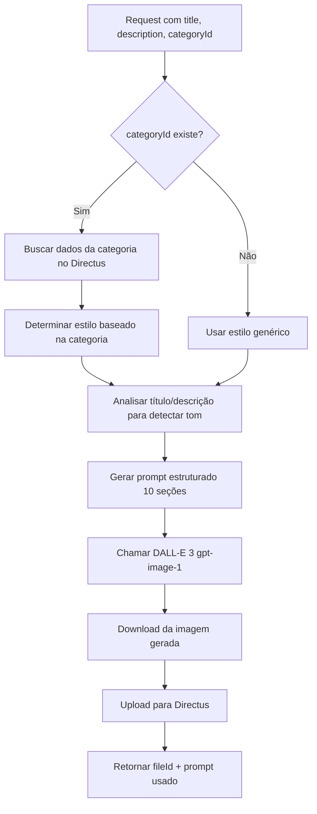

# Guia do Sistema Avançado de Geração de Prompts para Capas de Eventos

## Visão Geral

Este documento detalha o sistema sofisticado de geração de prompts implementado para criar imagens de capa profissionais usando DALL-E 3 (`gpt-image-1`).

## Arquitetura do Sistema

### 1. Coleta de Dados Contextual

O sistema coleta múltiplas fontes de informação:

```typescript
interface GenerateCoverRequest {
  title: string;              // Obrigatório - Título do evento
  description?: string;       // Opcional - Descrição completa
  categoryId?: string;        // Opcional - ID da categoria no Directus
  short_description?: string; // Opcional - Descrição curta para SEO
}
```

**Busca Automática de Categoria:**
- Se `categoryId` for fornecido, o sistema busca automaticamente os dados da categoria no Directus
- Dados retornados: `name`, `description`, `icon`, `color`
- Usado para personalizar o estilo da imagem

### 2. Mapeamento de Categorias para Estilos

O sistema possui um mapeamento inteligente de **10 categorias principais** com estilos visuais específicos:

| Categoria | Paleta de Cores | Elementos Visuais | Tom |
|-----------|----------------|-------------------|-----|
| 🔧 Tecnologia | Azul, roxo, ciano | Circuitos, formas geométricas, redes digitais | Futurista, corporativo |
| 📚 Workshop | Laranja, amarelo, teal | Elementos colaborativos, ferramentas, materiais educativos | Acessível, energético |
| 💼 Conferência | Navy, gold, branco | Palco, plateia, arquitetura de conferência | Corporativo, prestigioso |
| 🎵 Música | Pink elétrico, neon azul, roxo profundo | Instrumentos, ondas sonoras, luzes de show | Energético, artístico |
| ⚽ Esportes | Vermelho, preto, lime green | Equipamentos, poses de ação, estádios | Dinâmico, motivacional |
| 🎓 Educação | Azul céu, verde, amarelo | Livros, capelos, símbolos de conhecimento | Confiável, profissional |
| 🎨 Arte | Magenta, turquoise, gold | Respingos de tinta, ferramentas artísticas, galerias | Sofisticado, expressivo |
| 💼 Negócios | Navy, cinza, gold | Escritório, gráficos, cityscape | Sério, profissional |
| 💚 Saúde | Verde, branco, azul claro | Símbolos médicos, wellness, estilo de vida | Limpo, cuidadoso |
| 🍔 Gastronomia | Vermelho, laranja, marrom | Fotografia de comida, ambientes gastronômicos | Quente, convidativo |

**Suporte a Português e Inglês:**
- O sistema reconhece tanto nomes em português quanto em inglês
- Usa correspondência parcial para flexibilidade (ex: "tecnologia" ou "tech")

### 3. Detecção Inteligente de Tom

O sistema analisa o título e descrição do evento para detectar o tom apropriado:

| Padrão Detectado | Tom Aplicado |
|------------------|--------------|
| workshop, curso, aula, treinamento | Educacional, acessível, empoderador |
| conferência, summit, congresso | Profissional, autoritário, prestigioso |
| festa, show, festival, concert | Energético, excitante, celebratório |
| networking, meetup, encontro | Acolhedor, social, colaborativo |
| hackathon, competição, challenge | Competitivo, energético, inovador |
| lançamento, launch, estreia | Excitante, exclusivo, antecipatório |

### 4. Estrutura do Prompt (10 Seções)

O prompt gerado é dividido em **10 seções estruturadas**:

#### SEÇÃO 1: HEADER
Define a tarefa principal e formato de saída.

```
Create a professional, eye-catching event cover image in landscape format
(1792x1024 pixels, 16:9 aspect ratio).
```

#### SEÇÃO 2: MAIN SUBJECT
Título do evento e contexto principal.

```
MAIN SUBJECT: Event titled "[TÍTULO DO EVENTO]".
Short description: [DESCRIÇÃO CURTA]
Full context: [DESCRIÇÃO COMPLETA]
```

#### SEÇÃO 3: CATEGORY & STYLE GUIDELINES
Estilo visual baseado na categoria detectada.

```
CATEGORY: [NOME DA CATEGORIA].
STYLE GUIDELINES: [ESTILO ESPECÍFICO DA CATEGORIA]
```

#### SEÇÃO 4: COMPOSITION REQUIREMENTS
Regras de composição e layout.

```
--- COMPOSITION REQUIREMENTS ---
• Layout: Follow the rule of thirds, with the main focal point slightly off-center.
• Text space: Reserve the left third or top third of the image for text overlay
  (keep this area clean with solid or gradient background).
• Depth: Use foreground, midground, and background elements to create visual depth.
• Balance: Ensure visual balance between text-friendly space and decorative elements.
```

#### SEÇÃO 5: VISUAL STYLE
Técnicas visuais e estética.

```
--- VISUAL STYLE ---
• Photorealistic quality with professional photography aesthetic.
• High contrast and vibrant colors that stand out on social media feeds.
• Use dramatic lighting (rim lighting, cinematic lighting, or golden hour lighting).
• Apply depth of field (bokeh effect) to create professional separation between
  subject and background.
• Include subtle gradients or color overlays for cohesive color harmony.
```

#### SEÇÃO 6: TECHNICAL SPECS
Especificações técnicas da imagem.

```
--- TECHNICAL SPECS ---
• Resolution: High-quality, print-ready (300 DPI equivalent).
• Format: Landscape orientation (16:9 aspect ratio) - 1792x1024 pixels.
• Color mode: RGB with rich, saturated colors optimized for digital display.
• No embedded text: Leave text-friendly space but do not include actual
  text/typography in the image.
```

#### SEÇÃO 7: RESTRICTIONS
O que NÃO deve aparecer na imagem.

```
--- RESTRICTIONS ---
• DO NOT include any text, letters, numbers, or typography in the image itself.
• DO NOT include recognizable faces or identifiable people (use silhouettes or
  blurred figures if needed).
• DO NOT include logos, brand names, or copyrighted symbols.
• AVOID cluttered or busy compositions - maintain clean, professional aesthetic.
```

#### SEÇÃO 8: MOOD & ATMOSPHERE
Tom emocional e atmosfera.

```
--- MOOD & ATMOSPHERE ---
• Overall tone: [TOM DETECTADO AUTOMATICAMENTE].
• Evoke emotions: Excitement, anticipation, professionalism, and trust.
• Create a sense of premium quality and value.
```

#### SEÇÃO 9: INSPIRATION KEYWORDS
Palavras-chave para guiar a IA.

```
--- INSPIRATION KEYWORDS ---
Professional event photography, corporate event design, modern poster design,
cinematic composition, editorial photography, promotional material, high-end
event marketing.
```

## Exemplos de Prompts Gerados

### Exemplo 1: Workshop de Tecnologia

**Input:**
```json
{
  "title": "Workshop de React Avançado",
  "short_description": "Aprenda hooks avançados, performance optimization",
  "description": "Domine técnicas avançadas de React...",
  "categoryId": "categoria-tecnologia-uuid"
}
```

**Output (resumido):**
```
Create a professional, eye-catching event cover image in landscape format...

MAIN SUBJECT: Event titled "Workshop de React Avançado".
Short description: Aprenda hooks avançados, performance optimization.

CATEGORY: Tecnologia.
STYLE GUIDELINES: Modern tech aesthetic with gradients of blue, purple, and cyan.
Include abstract circuit patterns, geometric shapes, or digital network visualizations.

--- COMPOSITION REQUIREMENTS ---
Layout: Follow the rule of thirds...
Text space: Reserve the left third for text overlay...

--- VISUAL STYLE ---
Photorealistic quality with professional photography...
High contrast and vibrant colors...
Dramatic lighting (rim lighting, cinematic lighting)...

--- MOOD & ATMOSPHERE ---
Overall tone: Educational, approachable, and empowering.
```

### Exemplo 2: Show Musical

**Input:**
```json
{
  "title": "Festival de Música Eletrônica 2025",
  "description": "A maior festa de música eletrônica...",
  "categoryId": "categoria-musica-uuid"
}
```

**Output (resumido):**
```
MAIN SUBJECT: Event titled "Festival de Música Eletrônica 2025".

CATEGORY: Música.
STYLE GUIDELINES: Vibrant music event with dynamic colors like electric pink,
neon blue, and deep purple. Include musical instruments, sound waves, concert
lights, or crowd energy.

--- MOOD & ATMOSPHERE ---
Overall tone: Energetic, exciting, and celebratory.
```

### Exemplo 3: Evento Sem Categoria

**Input:**
```json
{
  "title": "Lançamento do Produto XYZ",
  "description": "Evento exclusivo de lançamento..."
}
```

**Output (resumido):**
```
STYLE GUIDELINES: Modern, professional event cover with bold, attention-grabbing
colors. Use abstract shapes, gradients, or thematic imagery.

--- MOOD & ATMOSPHERE ---
Overall tone: Exciting, exclusive, and anticipatory.
```

## Fluxo de Processamento



## Técnicas de Prompt Engineering Aplicadas

### 1. **Estruturação Clara**
- Dividir o prompt em seções bem definidas
- Usar marcadores (`•`, `---`) para facilitar parsing
- Headers em CAPS para destacar seções importantes

### 2. **Especificidade Contextual**
- Cores específicas por categoria (não genéricas)
- Elementos visuais concretos (não abstratos)
- Exemplos explícitos de técnicas (rim lighting, bokeh)

### 3. **Restrições Explícitas**
- Lista clara do que NÃO fazer (DO NOT)
- Evita problemas comuns (texto embutido, rostos reconhecíveis)
- Previne gerações inadequadas

### 4. **Composição Profissional**
- Regra dos terços mencionada explicitamente
- Espaço reservado para texto overlay
- Profundidade visual (foreground/midground/background)

### 5. **Tom Emocional Direcionado**
- Tom adaptado ao tipo de evento detectado
- Emoções específicas a evocar
- Atmosfera premium e profissional

## Performance e Custos

### Tempo de Geração
- **Geração do Prompt**: <100ms
- **Busca da Categoria**: ~200-500ms (se aplicável)
- **Chamada DALL-E 3**: ~10-15 segundos
- **Download + Upload**: ~2-3 segundos
- **Total**: ~12-19 segundos

### Custos
- **DALL-E 3 Standard (1792x1024)**: ~$0.080 USD por imagem
- **Estimativa em Reais**: ~R$ 0.40 por imagem (variável com câmbio)

## Boas Práticas de Uso

### 1. Sempre Fornecer Título
O título é **obrigatório** e serve como base para toda a geração.

### 2. Incluir Categoria Quando Possível
Categorias melhoram **significativamente** a qualidade e coerência da imagem.

### 3. Usar Descrição Curta
`short_description` (160 caracteres) é mais eficiente que descrição completa.

### 4. Evitar Descrições Muito Longas
Descrições são truncadas em 300 caracteres para não sobrecarregar o modelo.

### 5. Revisar Imagem Gerada
Sempre revise a imagem e regenere se necessário (tom pode variar).

## Limitações Conhecidas

1. **Texto Embutido**: Mesmo com restrições, DALL-E pode ocasionalmente gerar texto ilegível
2. **Faces**: Rostos podem aparecer mesmo solicitando silhuetas (menos comum)
3. **Consistência**: Tom pode variar entre gerações do mesmo prompt
4. **Idioma**: Prompts em inglês geram melhores resultados (mantido propositalmente)
5. **Aspecto Ratio**: 1792x1024 é o mais próximo de 1200x630, mas não exato

## Monitoramento e Logs

O sistema registra logs úteis para debugging:

```typescript
console.log('Category data loaded:', category.name);        // Categoria carregada
console.log('=== GENERATED PROMPT ===');                    // Prompt completo
console.log(prompt);
console.log('========================');
```

**Verificar logs no terminal do Next.js durante desenvolvimento.**

## Contribuindo com Novas Categorias

Para adicionar uma nova categoria:

1. **Defina o Estilo Visual**
   - Escolha 2-3 cores principais
   - Liste elementos visuais específicos
   - Defina o tom/atmosfera

2. **Adicione ao Mapeamento**
   ```typescript
   // src/app/api/ai/generate-cover/route.ts:108
   const categoryStyles: Record<string, string> = {
     'nova-categoria': 'Descrição detalhada do estilo...',
     // ...
   };
   ```

3. **Teste Extensivamente**
   - Gere 5-10 imagens com diferentes títulos
   - Verifique consistência de estilo
   - Ajuste descrição se necessário

4. **Documente**
   - Adicione exemplos visuais
   - Liste casos de uso
   - Identifique limitações

## Referências

- [OpenAI DALL-E 3 Documentation](https://platform.openai.com/docs/guides/images)
- [Prompt Engineering Guide](https://www.promptingguide.ai/)
- [Rule of Thirds in Photography](https://en.wikipedia.org/wiki/Rule_of_thirds)
- [Color Psychology in Marketing](https://www.verywellmind.com/color-psychology-2795824)

---

**Última Atualização:** Outubro 2025
**Autor:** Sistema de Geração Contextual de Prompts v2.0
