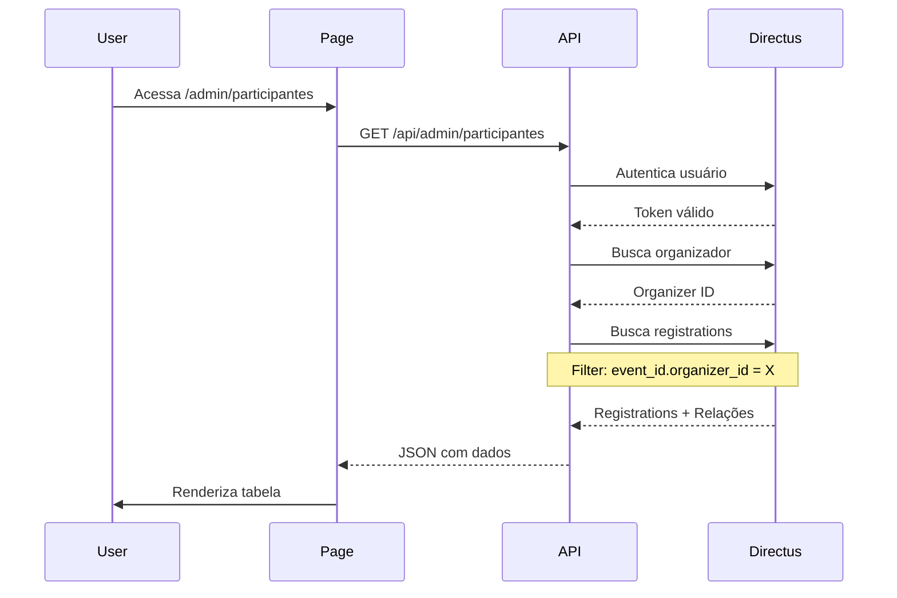
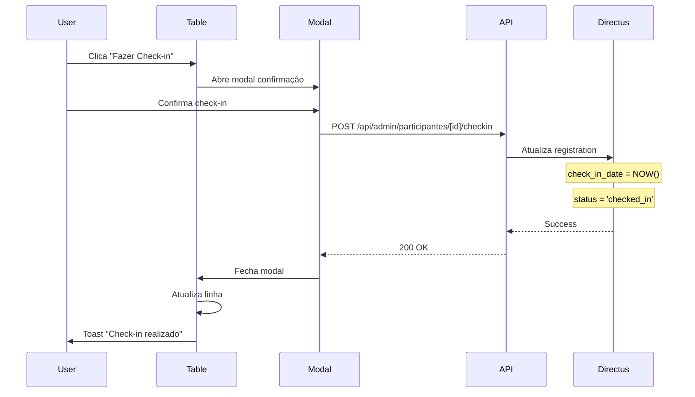
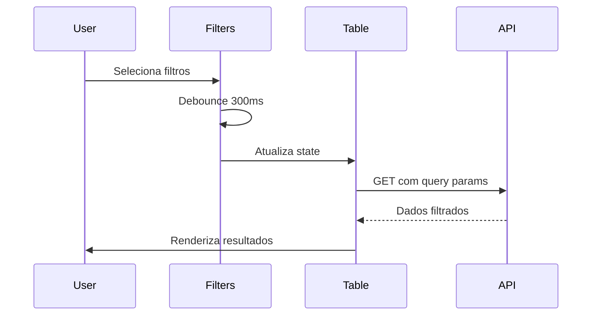

# Especificação de Feature: Gestão de Participantes

**Versão:** 1.0
**Data:** 2025-10-10
**Status:** Planejamento
**Responsável:** Desenvolvimento

---

## 📋 Sumário Executivo

Esta especificação descreve a implementação de uma página administrativa completa para gestão de participantes inscritos nos eventos do organizador. A solução permitirá visualização, filtragem, check-in e acompanhamento detalhado de todos os participantes através de uma interface profissional e intuitiva.

---

## 🎯 Objetivos

### Objetivo Principal
Criar uma interface centralizada e eficiente para organizadores gerenciarem todos os participantes dos seus eventos, com capacidade de:
- Visualizar lista unificada de participantes de todos os eventos
- Filtrar e buscar participantes de forma inteligente
- Realizar check-in de participantes
- Acessar informações detalhadas de cada participante

### Objetivos Secundários
- Melhorar a experiência do organizador na gestão de eventos
- Reduzir tempo de check-in durante eventos
- Fornecer insights sobre participantes através de filtros e visualizações
- Manter padrão visual consistente com o resto da aplicação

---

## 👥 Personas e Casos de Uso

### Persona Principal: Organizador de Eventos
**Cenário 1: Gestão Pré-Evento**
- João está preparando um evento de tecnologia
- Precisa ver quantos participantes confirmaram presença
- Quer filtrar por tipo de ingresso para organizar kits de boas-vindas
- Exporta lista para equipe de recepção

**Cenário 2: Check-in Durante Evento**
- Maria está na recepção do evento
- Busca participantes pelo nome ou email
- Realiza check-in clicando em um botão
- Visualiza status instantaneamente

**Cenário 3: Análise Pós-Evento**
- Carlos quer analisar taxa de comparecimento
- Filtra por evento e status de check-in
- Visualiza detalhes de participantes que não compareceram

---

## 📊 Estrutura de Dados

### Collection: `event_registrations`

```typescript
interface EventRegistration {
  // Identificação
  id: string;
  ticket_code: string;

  // Dados do Participante
  participant_name: string;
  participant_email: string;
  participant_phone?: string;
  participant_document?: string;
  user_id?: DirectusUser | string;

  // Relações
  event_id: Event | string;
  ticket_type_id?: EventTicket | string;

  // Status
  status: 'confirmed' | 'pending' | 'cancelled' | 'checked_in';
  payment_status: 'free' | 'paid' | 'pending' | 'refunded';

  // Check-in
  check_in_date?: string;

  // Dados Financeiros
  quantity: number;
  unit_price?: number;
  service_fee?: number;
  total_amount?: number;
  payment_method?: 'card' | 'pix' | 'boleto' | 'free';

  // Stripe
  stripe_payment_intent_id?: string;
  stripe_checkout_session_id?: string;

  // Timestamps
  date_created?: string;
  date_updated?: string;

  // Outros
  additional_info?: Record<string, any>;
}
```

### Dados Relacionados Necessários

**Event:**
- `title` - Nome do evento
- `slug` - Identificador único
- `start_date` - Data/hora de início
- `location_name` - Local do evento

**EventTicket:**
- `title` - Tipo do ingresso
- `price` - Preço do ingresso

**DirectusUser:**
- `first_name` - Nome
- `last_name` - Sobrenome
- `email` - Email
- `avatar` - Foto de perfil

---

## 🎨 Design e UX

### Estrutura da Página

```
┌─────────────────────────────────────────────────────────┐
│ HEADER                                                  │
│ ◄ Voltar | Gerenciar Participantes                     │
│ Visualize e gerencie todos os participantes dos         │
│ seus eventos                                            │
└─────────────────────────────────────────────────────────┘
┌─────────────────────────────────────────────────────────┐
│ BARRA DE AÇÕES                                          │
│ [🔍 Buscar...]  [Filtros ▼] [Status ▼]  [⬇ Exportar]  │
└─────────────────────────────────────────────────────────┘
┌─────────────────────────────────────────────────────────┐
│ MÉTRICAS RÁPIDAS (Cards)                               │
│ ┌─────────┐ ┌─────────┐ ┌─────────┐ ┌─────────┐      │
│ │Total    │ │Com      │ │Pendente │ │Check-in │      │
│ │Inscritos│ │Check-in │ │         │ │Taxa     │      │
│ │  245    │ │  189    │ │   32    │ │  77%    │      │
│ └─────────┘ └─────────┘ └─────────┘ └─────────┘      │
└─────────────────────────────────────────────────────────┘
┌─────────────────────────────────────────────────────────┐
│ TABELA DE PARTICIPANTES                                │
│ ┌───┬──────────┬────────┬─────────┬──────────┬────┐   │
│ │☑  │Participan│Evento  │Ingresso │Check-in  │Ação│   │
│ ├───┼──────────┼────────┼─────────┼──────────┼────┤   │
│ │ ☐ │Maria S.  │Tech...│VIP      │✓ 12/01   │... │   │
│ │ ☐ │João P.   │Work...│Meia     │-         │... │   │
│ │ ☐ │Ana M.    │Tech...│Normal   │✓ 11/01   │... │   │
│ └───┴──────────┴────────┴─────────┴──────────┴────┘   │
│                                                         │
│ Exibindo 1-25 de 245        [◄ Anterior] [Próxima ►]  │
└─────────────────────────────────────────────────────────┘
```

### Wireframe Detalhado

#### 1. Header da Página
```
┌───────────────────────────────────────────────────────────┐
│  ◄                                                        │
│  Gerenciar Participantes                                 │
│  Visualize e gerencie todos os participantes dos seus    │
│  eventos em um único lugar                               │
└───────────────────────────────────────────────────────────┘
```

**Elementos:**
- Botão voltar (seta esquerda) → navega para `/admin`
- Título: `Gerenciar Participantes` (text-3xl font-bold)
- Subtítulo descritivo (text-gray-600)

#### 2. Barra de Ferramentas
```
┌───────────────────────────────────────────────────────────┐
│ 🔍 [Buscar por nome, email ou código...              ]   │
│                                                           │
│ [📅 Todos os Eventos ▼] [🎫 Tipo Ingresso ▼]            │
│ [📊 Status ▼] [💳 Pagamento ▼] [✓ Check-in ▼]          │
│                                                           │
│                                   [⬇️ Exportar CSV]      │
└───────────────────────────────────────────────────────────┘
```

**Componentes:**
- **Campo de Busca**: Input full-width com debounce de 300ms
- **Filtros Dropdown**:
  - Evento (multi-select com busca)
  - Tipo de Ingresso (multi-select)
  - Status Inscrição (single-select)
  - Status Pagamento (single-select)
  - Status Check-in (checkbox "Apenas com check-in")
- **Botão Exportar**: Download CSV com dados filtrados

#### 3. Cards de Métricas
```
┌──────────────┐  ┌──────────────┐  ┌──────────────┐  ┌──────────────┐
│ 👥           │  │ ✓            │  │ ⏳           │  │ 📊           │
│ Total        │  │ Com Check-in │  │ Pendentes    │  │ Taxa         │
│              │  │              │  │              │  │ Check-in     │
│    245       │  │    189       │  │    32        │  │    77%       │
│ participantes│  │ confirmados  │  │ confirmações │  │              │
└──────────────┘  └──────────────┘  └──────────────┘  └──────────────┘
```

**Comportamento:**
- Cards responsivos (grid-cols-1 md:grid-cols-2 xl:grid-cols-4)
- Atualização em tempo real baseada nos filtros
- Hover effect sutil

#### 4. Tabela de Participantes (TanStack Table)

**Colunas:**

| Campo | Largura | Ordenável | Filtro | Descrição |
|-------|---------|-----------|--------|-----------|
| Checkbox | 40px | ❌ | ❌ | Seleção múltipla |
| Participante | 25% | ✅ | ✅ | Avatar + Nome + Email |
| Evento | 20% | ✅ | ✅ | Título do evento |
| Tipo Ingresso | 15% | ✅ | ✅ | Nome do ingresso + Quantidade |
| Pagamento | 12% | ✅ | ✅ | Status + Valor (badge colorido) |
| Check-in | 15% | ✅ | ✅ | Data/hora ou botão para fazer |
| Ações | 8% | ❌ | ❌ | Menu dropdown |

**Design das Células:**

```
┌────────────────────────────────────────────────────────────┐
│ ☐  [Avatar] Maria Santos                    TechConf 2025 │
│             maria@email.com                  15 Jan 19:00  │
│                                                             │
│             VIP (2x)        [✓ Pago] R$ 150   ✓ 12/01 14:30│
│                             ──────────────    ────────────  │
│                             Badge Verde        Badge Cinza  │
│                                                         ... │
└────────────────────────────────────────────────────────────┘
```

**Participante (Coluna Composta):**
```
┌──────────────────────────┐
│ [A]  Maria Santos        │ ← Nome (font-medium)
│      maria@email.com     │ ← Email (text-sm text-gray-500)
│      (11) 98765-4321     │ ← Telefone (text-xs, condicional)
└──────────────────────────┘
```

**Evento:**
```
┌──────────────────────┐
│ TechConf 2025        │ ← Título (font-semibold)
│ 15 Jan 2025, 19:00   │ ← Data (text-sm text-gray-600)
└──────────────────────┘
```

**Tipo Ingresso:**
```
┌──────────────────┐
│ VIP              │ ← Título (font-medium)
│ Quantidade: 2    │ ← Qtd (text-sm)
└──────────────────┘
```

**Pagamento:**
```
┌─────────────────┐
│ [ ✓ Pago ]      │ ← Badge (verde)
│ R$ 150,00       │ ← Valor (text-sm)
│ Cartão          │ ← Método (text-xs)
└─────────────────┘
```

**Badges de Status:**
- **Pago**: `bg-emerald-100 text-emerald-700 dark:bg-emerald-900/40`
- **Pendente**: `bg-amber-100 text-amber-700 dark:bg-amber-900/40`
- **Reembolsado**: `bg-rose-100 text-rose-700 dark:bg-rose-900/40`
- **Gratuito**: `bg-blue-100 text-blue-700 dark:bg-blue-900/40`

**Check-in:**
```
┌─────────────────────┐
│ ✓ 12 Jan, 14:30     │ ← Realizado (verde)
│ Ana Silva           │ ← Quem fez (opcional)
└─────────────────────┘

ou

┌─────────────────────┐
│ [Fazer Check-in]    │ ← Botão (azul)
└─────────────────────┘
```

**Ações (Dropdown):**
```
┌─────────────────────┐
│ 👁️  Ver detalhes    │
│ ✓  Fazer check-in   │
│ ✏️  Editar          │
│ 📧 Reenviar email   │
│ ─────────────────── │
│ 🚫 Cancelar         │
└─────────────────────┘
```

#### 5. Paginação
```
┌────────────────────────────────────────────────────────┐
│ Exibindo 1-25 de 245 participantes                    │
│                                                        │
│        [◄ Anterior]  [1] [2] 3 [4] [5]  [Próxima ►]  │
└────────────────────────────────────────────────────────┘
```

**Configuração:**
- 25 itens por página (padrão)
- Opções: 10, 25, 50, 100
- Navegação com números de página
- Indicador de total

---

## 🔧 Funcionalidades Detalhadas

### F1: Busca Inteligente

**Comportamento:**
- Busca em tempo real (debounce 300ms)
- Campos pesquisáveis:
  - `participant_name`
  - `participant_email`
  - `participant_phone`
  - `participant_document`
  - `ticket_code`
- Case-insensitive
- Destaque de resultados (opcional)

**Implementação:**
```typescript
const searchFilter = {
  _or: [
    { participant_name: { _icontains: searchTerm } },
    { participant_email: { _icontains: searchTerm } },
    { participant_phone: { _icontains: searchTerm } },
    { participant_document: { _icontains: searchTerm } },
    { ticket_code: { _icontains: searchTerm } },
  ],
};
```

### F2: Filtros Avançados

#### Filtro por Evento
- Dropdown multi-select
- Busca dentro do dropdown
- Mostrar apenas eventos do organizador
- Opção "Todos os eventos" (padrão)
- Badge com contagem de filtros ativos

#### Filtro por Tipo de Ingresso
- Multi-select
- Agrupado por evento
- Mostra preço do ingresso

#### Filtro por Status da Inscrição
- Radio buttons:
  - Todos (padrão)
  - Confirmado
  - Pendente
  - Cancelado
  - Com Check-in

#### Filtro por Status de Pagamento
- Checkboxes:
  - Pago
  - Pendente
  - Reembolsado
  - Gratuito

#### Filtro por Check-in
- Toggle switch: "Apenas com check-in"
- Date range picker: "Check-in entre [data] e [data]"

### F3: Check-in de Participante

**Fluxo:**
1. Usuário clica em "Fazer Check-in" na linha ou no menu de ações
2. Modal de confirmação abre:
   ```
   ┌─────────────────────────────────────┐
   │ Confirmar Check-in                  │
   │                                     │
   │ Participante: Maria Santos          │
   │ Evento: TechConf 2025               │
   │ Ingresso: VIP                       │
   │                                     │
   │ Data/Hora: 10 Jan 2025, 14:32      │
   │                                     │
   │ [Cancelar]      [Confirmar Check-in]│
   └─────────────────────────────────────┘
   ```
3. Ao confirmar:
   - Atualiza `check_in_date` com timestamp atual
   - Atualiza `status` para `'checked_in'`
   - Mostra toast de sucesso
   - Linha da tabela atualiza visualmente

**Validações:**
- Não permitir check-in se status = 'cancelled'
- Não permitir check-in se payment_status = 'pending' (configurável)
- Mostrar warning se check-in já foi feito

**Desfazer Check-in:**
- Opção no menu de ações: "Desfazer Check-in"
- Confirmar ação
- Limpa `check_in_date`
- Volta status para 'confirmed'

### F4: Visualização de Detalhes

**Navegação:**
- Click na linha OU
- Menu de ações → "Ver detalhes"
- Navega para `/admin/participantes/[id]`

**Página de Detalhes:**

```
┌────────────────────────────────────────────────────────┐
│ ◄ Voltar | Detalhes do Participante                   │
└────────────────────────────────────────────────────────┘
┌────────────────────────────────────────────────────────┐
│ INFORMAÇÕES PESSOAIS                                   │
│ ┌──────────────┐                                       │
│ │   [Avatar]   │  Maria Santos                         │
│ │   [Iniciais] │  maria@email.com                      │
│ └──────────────┘  (11) 98765-4321                      │
│                   CPF: 123.456.789-00                  │
└────────────────────────────────────────────────────────┘
┌────────────────────────────────────────────────────────┐
│ DETALHES DA INSCRIÇÃO                                  │
│                                                         │
│ Código do Ingresso:    TKT-2025-001234                 │
│ Evento:                TechConf 2025                   │
│ Data do Evento:        15 Jan 2025, 19:00              │
│ Tipo de Ingresso:      VIP                             │
│ Quantidade:            2                                │
│ Status:                [✓ Confirmado]                   │
│                                                         │
│ Data da Inscrição:     10 Jan 2025, 10:23              │
│ Última Atualização:    10 Jan 2025, 14:32              │
└────────────────────────────────────────────────────────┘
┌────────────────────────────────────────────────────────┐
│ PAGAMENTO                                              │
│                                                         │
│ Status:                [✓ Pago]                         │
│ Método:                Cartão de Crédito               │
│ Valor Unitário:        R$ 75,00                        │
│ Quantidade:            2                                │
│ Taxa de Serviço:       R$ 15,00                        │
│ Valor Total:           R$ 165,00                       │
│                                                         │
│ Stripe Payment ID:     pi_abc123xyz                    │
│ Data do Pagamento:     10 Jan 2025, 10:24              │
└────────────────────────────────────────────────────────┘
┌────────────────────────────────────────────────────────┐
│ CHECK-IN                                               │
│                                                         │
│ Status:                ✓ Check-in Realizado            │
│ Data/Hora:             12 Jan 2025, 14:30              │
│                                                         │
│ [Desfazer Check-in]                                    │
│                                                         │
│ OU (se não fez check-in)                               │
│                                                         │
│ Status:                Aguardando check-in             │
│ [Fazer Check-in Agora]                                 │
└────────────────────────────────────────────────────────┘
┌────────────────────────────────────────────────────────┐
│ INFORMAÇÕES ADICIONAIS                                 │
│                                                         │
│ {Exibir additional_info em formato JSON formatado}    │
└────────────────────────────────────────────────────────┘
┌────────────────────────────────────────────────────────┐
│ AÇÕES                                                  │
│                                                         │
│ [📧 Reenviar Email de Confirmação]                     │
│ [✏️ Editar Informações]                                 │
│ [🚫 Cancelar Inscrição]                                │
└────────────────────────────────────────────────────────┘
```

### F5: Exportação de Dados

**Formatos Suportados:**
- CSV (padrão)
- Excel (opcional, futura)

**Colunas Exportadas:**
```
Código,Nome,Email,Telefone,Documento,Evento,Data Evento,
Tipo Ingresso,Quantidade,Valor Total,Status Pagamento,
Status Inscrição,Data Check-in,Data Inscrição
```

**Comportamento:**
- Respeita filtros ativos
- Nome do arquivo: `participantes_YYYY-MM-DD_HHmmss.csv`
- Encoding: UTF-8 com BOM (para Excel)
- Separador: `,`
- Toast de sucesso ao iniciar download

### F6: Ações em Lote (Futuro)

- Seleção múltipla via checkboxes
- Barra de ações aparece quando há itens selecionados
- Ações disponíveis:
  - Check-in em lote
  - Exportar selecionados
  - Reenviar emails
  - Cancelar inscrições (com confirmação)

---

## 🔐 Permissões e Segurança

### Regras de Acesso

1. **Autenticação Obrigatória:**
   - Usuário deve estar logado
   - Deve ter perfil de organizador válido

2. **Isolamento de Dados:**
   - Organizador vê APENAS participantes dos SEUS eventos
   - Filtro automático: `event_id.organizer_id.user_id = $accountability.user`

3. **Permissões por Ação:**
   - Visualizar: Todos os organizadores
   - Check-in: Todos os organizadores
   - Editar: Apenas organizador do evento
   - Cancelar: Apenas organizador do evento
   - Exportar: Todos os organizadores

### Implementação de Segurança

**Server-side (API Routes):**
```typescript
// Verificar se usuário é organizador
const organizer = await directus.request(
  readItems('organizers', {
    filter: { user_id: { _eq: userId } },
    limit: 1,
  })
);

if (!organizer) {
  return Response.json({ error: 'Unauthorized' }, { status: 403 });
}

// Filtrar apenas eventos do organizador
const registrations = await directus.request(
  readItems('event_registrations', {
    filter: {
      event_id: {
        organizer_id: { _eq: organizer.id }
      }
    },
    // ... outros filtros
  })
);
```

---

## 🔄 Fluxos de Dados

### Fluxo de Carregamento Inicial



### Fluxo de Check-in



### Fluxo de Filtros



---

## 📱 Responsividade

### Breakpoints

- **Mobile** (< 640px):
  - Tabela vira cards verticais
  - Filtros em accordion
  - Cards de métricas 1 coluna
  - Ações via swipe ou menu

- **Tablet** (640px - 1024px):
  - Tabela com scroll horizontal
  - Cards de métricas 2 colunas
  - Filtros em duas linhas

- **Desktop** (> 1024px):
  - Layout completo
  - Cards de métricas 4 colunas
  - Todos os filtros visíveis

### Mobile-First Design

**Card de Participante (Mobile):**
```
┌────────────────────────────────┐
│ [A] Maria Santos               │
│     maria@email.com            │
│                                │
│ Evento: TechConf 2025          │
│ Ingresso: VIP (2x)             │
│                                │
│ [✓ Pago] R$ 150,00            │
│ ✓ Check-in: 12/01 14:30       │
│                                │
│ [Ver Detalhes] [Check-in]     │
└────────────────────────────────┘
```

---

## ⚡ Performance

### Otimizações

1. **Paginação Server-side:**
   - Máximo 25 itens por request
   - Offset e limit via query params

2. **Lazy Loading:**
   - Avatares carregam sob demanda
   - Imagens com placeholder

3. **Debouncing:**
   - Busca: 300ms
   - Filtros: 300ms

4. **Caching:**
   - Cache de métricas: 60s
   - Cache de lista de eventos: 5min

5. **Virtual Scrolling (Futuro):**
   - TanStack Virtual para listas grandes
   - Renderiza apenas itens visíveis

### Métricas de Performance

- **LCP:** < 2.5s
- **FID:** < 100ms
- **CLS:** < 0.1
- **Tempo de resposta API:** < 500ms

---

## 🧪 Casos de Teste

### Cenários de Teste

#### CT-01: Carregamento Inicial
- **Dado:** Organizador com 5 eventos e 100 participantes
- **Quando:** Acessa /admin/participantes
- **Então:**
  - Vê lista com primeiros 25 participantes
  - Métricas corretas no topo
  - Filtros resetados

#### CT-02: Busca por Nome
- **Dado:** Lista de participantes carregada
- **Quando:** Digita "Maria" no campo de busca
- **Então:**
  - Espera 300ms (debounce)
  - Lista filtra para mostrar apenas "Maria"
  - Paginação reseta para página 1

#### CT-03: Check-in Bem-sucedido
- **Dado:** Participante sem check-in
- **Quando:** Clica em "Fazer Check-in" e confirma
- **Então:**
  - Modal fecha
  - Linha atualiza mostrando data/hora
  - Toast de sucesso
  - Badge muda para "Com check-in"

#### CT-04: Check-in Duplicado
- **Dado:** Participante já tem check-in
- **Quando:** Tenta fazer check-in novamente
- **Então:**
  - Modal mostra aviso
  - Oferece opção "Desfazer e refazer"
  - Não permite duplo check-in

#### CT-05: Filtro por Evento
- **Dado:** 3 eventos diferentes
- **Quando:** Seleciona apenas "TechConf 2025"
- **Então:**
  - Lista mostra apenas participantes deste evento
  - Contador de resultados atualiza
  - Badge de filtro ativo aparece

#### CT-06: Exportação CSV
- **Dado:** 50 participantes filtrados
- **Quando:** Clica em "Exportar"
- **Então:**
  - Download inicia
  - Arquivo contém 51 linhas (header + 50 dados)
  - Codificação UTF-8 com BOM

#### CT-07: Navegação para Detalhes
- **Dado:** Lista de participantes
- **Quando:** Clica em uma linha
- **Então:**
  - Navega para /admin/participantes/[id]
  - Mostra todos os detalhes
  - Botão voltar funciona

#### CT-08: Segurança - Organizador Errado
- **Dado:** Organizador A tenta acessar participante do Organizador B
- **Quando:** Acessa URL direta /admin/participantes/[id-do-outro]
- **Então:**
  - Retorna 403 Forbidden
  - Redireciona para página de erro

---

## 🎯 Critérios de Aceitação

### Obrigatórios (MVP)

- [ ] Página lista todos os participantes dos eventos do organizador
- [ ] Busca funciona em nome, email, telefone e código
- [ ] Filtros por evento, ingresso, status funcionam
- [ ] Check-in pode ser realizado e atualiza instantaneamente
- [ ] Página de detalhes mostra todas as informações
- [ ] Exportação CSV funciona com dados corretos
- [ ] Paginação funciona corretamente
- [ ] Responsivo em mobile, tablet e desktop
- [ ] Organizador vê apenas seus eventos
- [ ] Dark mode funciona

### Desejáveis (Pós-MVP)

- [ ] Ações em lote (check-in múltiplo)
- [ ] Exportação Excel
- [ ] QR Code para check-in
- [ ] Estatísticas avançadas
- [ ] Histórico de ações
- [ ] Notificações em tempo real
- [ ] Filtro por data range
- [ ] Virtual scrolling para listas grandes

---

## 📦 Dependências Técnicas

### Novas Dependências

```json
{
  "@tanstack/react-table": "^8.20.5",
  "@tanstack/react-virtual": "^3.10.8"
}
```

### Componentes Shadcn/UI Necessários

- ✅ Badge (já existe)
- ✅ Button (já existe)
- ✅ Input (já existe)
- ✅ Dialog (já existe)
- ✅ Dropdown Menu (já existe)
- ✅ Checkbox (já existe)
- ✅ Avatar (já existe)
- ⚠️ Select (verificar se multi-select funciona)
- ⚠️ Popover (para filtros avançados)
- ⚠️ Calendar (para filtro de datas)
- ⚠️ Command (para busca em dropdowns)

---

## 🗂️ Estrutura de Arquivos

```
src/
├── app/
│   └── admin/
│       └── participantes/
│           ├── page.tsx                    # Página principal
│           ├── [id]/
│           │   └── page.tsx                # Detalhes
│           ├── _components/
│           │   ├── ParticipantsTable.tsx   # Tabela TanStack
│           │   ├── ParticipantRow.tsx      # Linha customizada
│           │   ├── ParticipantFilters.tsx  # Barra de filtros
│           │   ├── MetricsCards.tsx        # Cards de métricas
│           │   ├── CheckInDialog.tsx       # Modal de check-in
│           │   ├── ExportButton.tsx        # Botão exportar
│           │   ├── ParticipantDetails.tsx  # View de detalhes
│           │   └── columns.tsx             # Definição de colunas
│           └── _lib/
│               ├── types.ts                # Types específicos
│               ├── queries.ts              # Queries Directus
│               ├── utils.ts                # Utilidades
│               └── export.ts               # Lógica de exportação
│
├── components/
│   └── admin/
│       └── (componentes compartilhados)
│
└── lib/
    └── directus/
        └── fetchers.ts                     # Adicionar fetch functions
```

---

## 🚀 Roadmap de Implementação

### Fase 1: Setup e Estrutura (2-3 horas)
1. Instalar dependências (TanStack Table)
2. Criar estrutura de pastas
3. Definir types TypeScript
4. Setup básico da página

### Fase 2: Listagem Básica (3-4 horas)
1. Implementar fetch de dados
2. Criar tabela básica TanStack
3. Definir colunas
4. Paginação server-side

### Fase 3: Filtros e Busca (4-5 horas)
1. Campo de busca com debounce
2. Filtros de evento, ingresso, status
3. Integração com query da tabela
4. Cards de métricas

### Fase 4: Check-in (2-3 horas)
1. Dialog de confirmação
2. API route para check-in
3. Atualização otimista
4. Validações

### Fase 5: Detalhes e Ações (3-4 horas)
1. Página de detalhes
2. Navegação entre páginas
3. Ações adicionais (reenviar email, etc)
4. Exportação CSV

### Fase 6: Polimento (2-3 horas)
1. Responsividade mobile
2. Dark mode
3. Tratamento de erros
4. Loading states
5. Empty states

### Fase 7: Testes e Refinamento (2-3 horas)
1. Testes manuais
2. Correção de bugs
3. Otimizações de performance
4. Ajustes de UX

**Tempo Total Estimado:** 18-25 horas

---

## 📚 Referências e Inspirações

### Design System
- Shadcn/UI: https://ui.shadcn.com/
- Radix UI Primitives: https://www.radix-ui.com/

### Bibliotecas
- TanStack Table: https://tanstack.com/table/
- TanStack Virtual: https://tanstack.com/virtual/

### Padrões Existentes
- `/admin/financeiro` - Tabela de transações (referência)
- `/admin/eventos/[id]/participantes` - Estrutura básica

### Exemplos de UI
- Eventbrite Dashboard
- Stripe Dashboard
- Linear (organização de tabelas)

---

## ✅ Checklist de Implementação

### Preparação
- [ ] Criar branch feature/participantes-management
- [ ] Instalar dependências
- [ ] Criar estrutura de pastas
- [ ] Definir types

### Backend
- [ ] API route: GET /api/admin/participantes
- [ ] API route: POST /api/admin/participantes/[id]/checkin
- [ ] API route: DELETE /api/admin/participantes/[id]/checkin
- [ ] API route: GET /api/admin/participantes/export
- [ ] Queries Directus otimizadas
- [ ] Validações de segurança

### Frontend - Listagem
- [ ] Página principal /admin/participantes
- [ ] TanStack Table setup
- [ ] Colunas responsivas
- [ ] Paginação
- [ ] Loading states
- [ ] Empty states

### Frontend - Filtros
- [ ] Campo de busca
- [ ] Filtro de eventos
- [ ] Filtro de ingressos
- [ ] Filtro de status
- [ ] Filtro de pagamento
- [ ] Badges de filtros ativos
- [ ] Reset filtros

### Frontend - Métricas
- [ ] Card total participantes
- [ ] Card check-ins
- [ ] Card pendentes
- [ ] Card taxa de check-in
- [ ] Atualização em tempo real

### Frontend - Check-in
- [ ] Botão fazer check-in
- [ ] Dialog de confirmação
- [ ] Atualização otimista
- [ ] Toast de sucesso
- [ ] Desfazer check-in
- [ ] Validações

### Frontend - Detalhes
- [ ] Página /admin/participantes/[id]
- [ ] Layout de informações
- [ ] Seções colapsáveis
- [ ] Navegação breadcrumb
- [ ] Ações disponíveis

### Frontend - Exportação
- [ ] Botão exportar
- [ ] Geração CSV
- [ ] Respeitar filtros
- [ ] Nomes de arquivo corretos
- [ ] Encoding UTF-8

### Responsividade
- [ ] Mobile view (< 640px)
- [ ] Tablet view (640-1024px)
- [ ] Desktop view (> 1024px)
- [ ] Touch gestures (mobile)

### Acessibilidade
- [ ] Navegação por teclado
- [ ] ARIA labels
- [ ] Screen reader support
- [ ] Contraste de cores
- [ ] Focus indicators

### Performance
- [ ] Code splitting
- [ ] Lazy loading
- [ ] Debouncing
- [ ] Memoização
- [ ] Virtual scrolling (futuro)

### Testes
- [ ] Testes de carregamento
- [ ] Testes de filtros
- [ ] Testes de check-in
- [ ] Testes de segurança
- [ ] Testes mobile

### Documentação
- [ ] Comentários no código
- [ ] README atualizado
- [ ] Changelog atualizado
- [ ] Screenshots

### Deploy
- [ ] Build sem erros
- [ ] Types sem erros
- [ ] Lint sem erros
- [ ] PR criado
- [ ] Code review
- [ ] Merge para main

---

## 📝 Notas Adicionais

### Considerações de UX

1. **Feedback Visual Imediato:**
   - Todas as ações devem ter feedback instantâneo
   - Loading spinners para operações assíncronas
   - Toast notifications para sucesso/erro
   - Animações suaves de transição

2. **Tolerância a Erros:**
   - Confirmações para ações destrutivas
   - Opção de desfazer quando possível
   - Mensagens de erro claras e acionáveis
   - Validações em tempo real

3. **Eficiência do Usuário:**
   - Atalhos de teclado (futuro)
   - Busca rápida com autocomplete
   - Lembrar últimos filtros usados (localStorage)
   - Exportação rápida

### Melhorias Futuras

1. **Real-time Updates:**
   - WebSocket para atualização ao vivo
   - Notificações de check-ins em tempo real

2. **Analytics Avançado:**
   - Gráficos de comparecimento
   - Tendências de vendas
   - Análise demográfica

3. **Automações:**
   - Email automático pós-check-in
   - Lembrete de check-in (WhatsApp/SMS)
   - Relatórios automáticos

4. **Integrações:**
   - QR Code scanner via câmera
   - Importação de participantes (CSV)
   - Integração com CRM

---

**Documento criado em:** 10 de Janeiro de 2025
**Última atualização:** 10 de Janeiro de 2025
**Versão:** 1.0
**Status:** Aprovado para implementação
